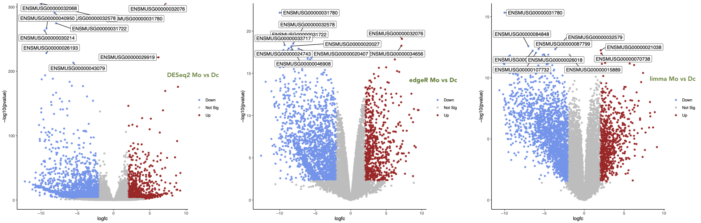

# `Volcano Plot create a volcano plot`

----

  1. Select the `Volcano Plot create a volcano plot` tool with the following parameters:
      - `Specify an input file`: the DESeq2 result file
      - `FDR (adjusted P value)`: Column: 7
      - `P value (raw)`: Column: 6
      - `Log Fold Change`: Column: 3
      - `Labels`: Column: 1
      - `Points to label`: Significant
          - `Only label top most significant`: 15
      - `Plot Options`:
          - `Label Boxes`: No
          - `Labels for Legend`: Down,NotSig,Up
  2. `Execute`
  
  You should obtain something like :
  

  
