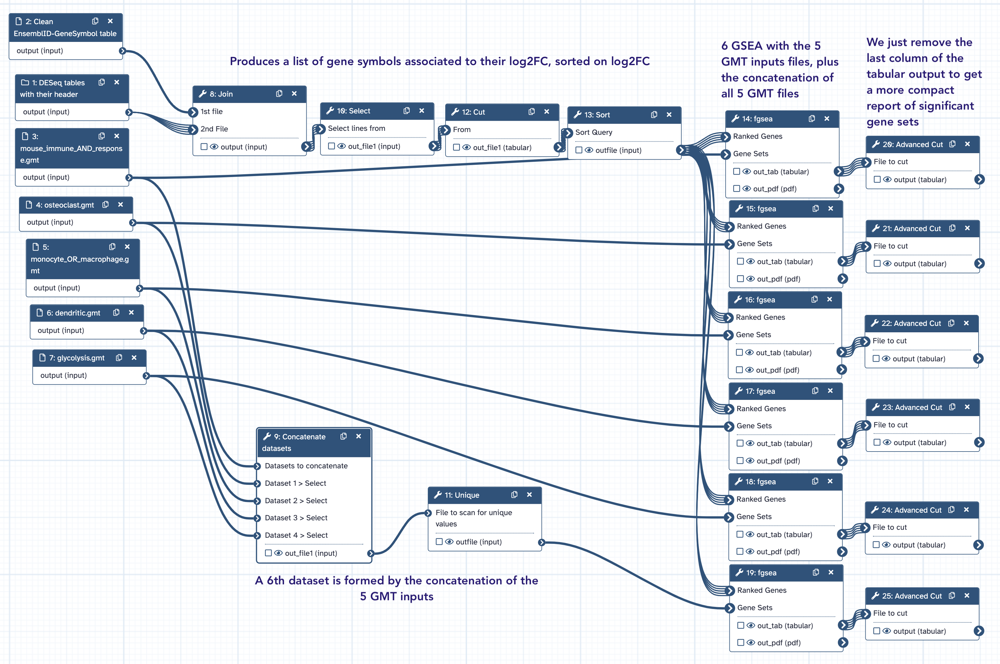

# fGSEA

fgsea is a Bioconductor package for fast preranked gene set enrichment analysis (GSEA) which
has been "wrapped" for use in the Galaxy framework.
As all GSEA approaches, fgsea implement an algorithm for cumulative GSEA-statisti
calculation. We will use it in a the standard way, ie basing our metrics on ==fold changes==
that computed using the DESeq2 Galaxy tool.

## fgsea inputs

#### 1. The collection of DESeq2 DE tables (with headers)
fgsea reauires first a two-column file containing a ranked list of genes. The first column
must contain the gene identifiers and the second column the statistic used to rank. Gene
identifiers ==must be unique== (not repeated) within the file and must be ==the same type==
as the ==identifiers in the Gene Sets file==.

Since what is expected is in the form of

| Symbol | Ranked Stat |
|---|---|
| VDR | 67.198 |
| IL20RA | 65.963 |
| MPHOSPH10 | 51.353 |
| RCAN1 | 50.269 |
| HILPDA | 50.015 |
| TSC22D3 | 47.496 |
| FAM107B | 45.926 |

and that our DESeq tables contain only Ensembl identifiers, we will start from the DEseq2
collection and replace Ensembl identifiers by gene symbols (using a table generated in the
previous section)

--> Thus, copy the collection `DESeq2 Results Tables` from the history `PRJNA630433
DESeq2 analysis` in a new history that you will name `PRJNA630433 fgsea`

#### 2. The table `EnsemblID-GeneSymbol table`

As mentionned above.

Note that you have generated this table in the previous section.

It is also available in the data library `IOC_bulk_RNAseq / Mouse reference files`, as well
as in your own data library (if you followed the instructions).

--> Copy `ENTREZID-GeneSymbol table` in your history `PRJNA630433 fgsea`

#### 3. One or several GMT files

GMT (Gene Matrix Transposed) files are available at
https://www.gsea-msigdb.org/gsea/msigdb/mouse/collections.jsp

They are tabular files looking like:

| HALLMARK_APOPTOSIS | http://www.broadinstitute.org/gsea/msigdb/cards/HALLMARK_APOPTOSIS | CASP3 | CASP9 | ... |
|---|---|---|---|---|
| HALLMARK_HYPOXIA | http://www.broadinstitute.org/gsea/msigdb/cards/HALLMARK_HYPOXIA | PGK1 | PDK1 | ... |

Note that in such a file, each line represents a gene set. The two first columns identify
the gene set (its name and it description URL). For each line, the number of column is
otherwise variable, with one column for each symbol of gene belonging to the gene set. Thus,
the number of these extra columns starting at col-3 reflects the number of genes in the
geneset.

We have downloaded several GMT files on purpose from
https://www.gsea-msigdb.org/gsea/msigdb/mouse/collections.jsp and made this files available
from the data library `IOC_bulk_RNAseq / Mouse reference files`.

--> Copy the following datasets in the history `PRJNA630433 fgsea`:

- [x] dendritic.gmt
- [x] glycolysis.gmt
- [x] monocyte_OR_macrophage.gmt
- [x] mouse_immune_AND_response.gmt
- [x] osteoclast.gmt

??? note "How did we generated the GMT files"
    These files were retrieved from a search on [msigdb](https://www.gsea-msigdb.org/gsea/msigdb)
    with the keyword(s) indicated in their title.
    
    Do no hesitate to generate your own GMT files using `msigdb`

## The `fgsea` workflow

The Galaxy workflow [Galaxy-Workflow-fgsea.ga](Galaxy-Workflow-fgsea.ga) performs fgsea
analysis from

- [x] The collection `DESeq2 Results Tables` (history `PRJNA630433 DESeq2 analysis`)
- [x] The dataset `ENTREZID-GeneSymbol table` (from the data library `IOC_bulk_RNAseq /
Mouse reference files`) or where available
- [x] 5 GMT files dendritic.gmt, glycolysis.gmt, monocyte_OR_macrophage.gmt,
  mouse_immune_AND_response.gmt,osteoclast.gmt.

**==Run this workflow in the dedicated history `PRJNA630433 fgsea` paying extra attention to
select the appropriate input datasets (follow the workflow form instructions)==**
