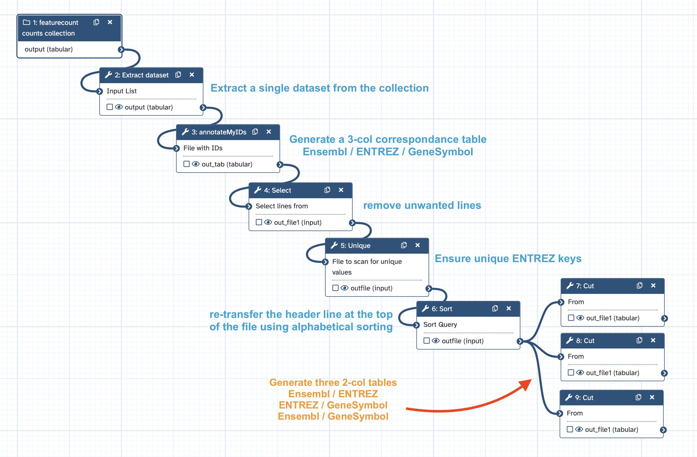

# Introduction to week-6 exercises
Using previous results obtained in the course of PRJNA630433 analysis, we are going to
perform successively a ==fGSEA== (**f**ast preranked **G**ene *S*et **E**nrichment
**A**nalysis) and an ==EGSEA== (**E**nsemble of **G**ene **S**et **E**nrichment
**A**nalyses) with the corresponding Galaxy tools.

Since this is the last week in the program where we run galaxy tools, we are also going to
upgrade the way we use Galaxy, making it "workflow-oriented". Thus Instead of describing
each galaxy tool run and showing you the details of the tool forms, we will provide a global
description of Workflows (inputs, outputs, purpose of the pipeline of steps)
and, most importantly, the corresponding workflow file as well as a screenshot of this file
in the Galaxy Workflow Editor.

## Tables of correspondances between Ensembl, ENTREZ and Gene Symbol IDs.

For both fGSEA and EGSEA, we will some computation steps require tables to convert Ensembl
to ENTREZ IDs, ENTREZ to Gene Symbol IDs or Ensembl to Gene Symbol IDs.

This is a perfect occasion to use the new training method described above.

Thus, we are going to use a Galaxy workflow that generates these three tables.

The input material will be a collection of featurecounts tables that we previously
generates in the `PRJNA630433 FeatureCounts Counting on HISAT2 bam alignments` history.

Thus, to begin, copy the dataset `Dc FeatureCounts counts` from this history to a new
history which you will name `Conversion Tables`. This is all we need as an input in this
history. The rest of dataset will be programmatically generated by a galaxy workflow
`Ensembl-Entrez-GeneSymbol tables` that

1. Extracts a dataset from the input data collection.
2. Uses the first column of this dataset (the Ensembl gene identifiers of the PRJNA630433)
with the `annotate my IDs` tool to generate at three-columns dataset, with EnsemblIDs,
ENTREZIDs (NCBI's nomenclature, raw numbers) and GeneSymbol IDs, respectively.
3. Filters out irrelevant lines (improper matchs) with `NA` or with `Rik` containing Gene
Symbols (these genes were identified in the course of the Riken project and are not considered
as supported by enough evidence to be included in GSEA)
4. Ensures that each ENTREZ IDs in the table are unique
5. Ensures that the final clean table has a first line header (the previous `unique` step
reorder the lines in an unpredictable way)
6. Generates three tables by cutting the final 3-col table with c1,c2, c1,c3, and c1,c3,
respectively and renames these tables accordingly to their content.

## The `Ensembl-Entrez-GeneSymbol tables` workflow

The workflow is available in a Galaxy/json format (.ga)
[here](Galaxy-Workflow-Ensembl-Entrez-GeneSymbol_tables.ga)

There is several ways to use it:

- [x] Download the file and reupload it as a new workflow using the workflow menu.
- [x] These workflow exists already in the server artbio.snv.jussieu.fr and was shared
with you. Thus, it is already visible in your workflow list (workflow menu), and you can
run it as is. ==However== :warning:, to better visualize this workflow you need to `copy`
it in your account. When this operation is done, new menu items are available for this
workflow, includin `edit`
- [x] Finally, you can upload a workflow in your account using its URL. For instance, if
you click the `Import` button in your workflow list (workflow menu), you can paste the
URL of this workflow in this course, and get it imported in you workflow list right away.

The graphical view of the workflow is the following. We have annotated this view but within
the Galaxy workflow editor, just click on each step of the workflow to see the details and
parameters (right hand part of the editor) used by the tool in this workflow.

## RUN the `Ensembl-Entrez-GeneSymbol tables` workflow

- [x] Be sure you are in the right history `Ensembl-Entrez-GeneSymbol tables`
- [x] Go to the workflow menu and click on the run icon of the workflow
`Ensembl-Entrez-GeneSymbol tables`
- [x] Ensure the appropriate input in select for the workflow (here there is only one dataset
in the history, no risk of error !)
- Click the `Run Workflow` button.

When the workflow has run you'll see that the three last dataset, appropriately named are
the one we expected. You can use these datasets latter when needed.

:warning: However, it is even more convenient to transfer these datasets in your data
library ! Just do it !
---