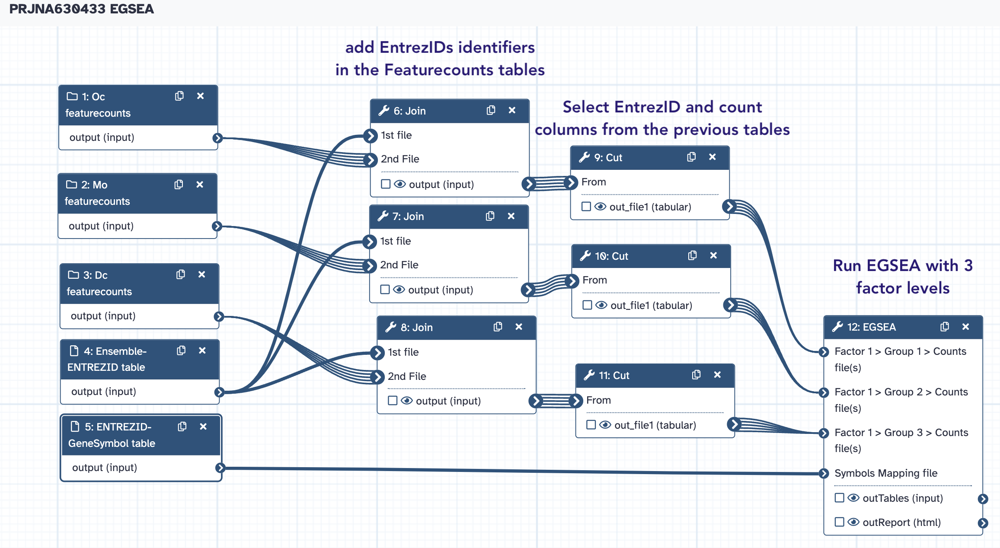

# EGSEA

EGSEA, an acronym for Ensemble of Gene Set Enrichment Analyses, is a Bioconductor package
that utilizes the analysis results of eleven prominent GSE algorithms from the literature
to calculate collective significance scores for gene sets. These methods are currently:
**ora, globaltest, plage, safe, zscore, gage, ssgsea, roast, fry, padog, camera, gsva**.
The **ora, gage, camera and gsva** methods depend on a competitive null hypothesis while
the remaining seven methods are based on a self-contained hypothesis. EGSEA’s gene set
database, the EGSEAdata Bioconductor package, contains around 25,000 gene sets from 16
collections from MSigDB, KEGG and GeneSetDB. ==Supported organisms are human, mouse and rat,
however MSigDB is only available for human and mouse==.

An example
[EGSEA workflow](https://www.bioconductor.org/help/workflows/EGSEA123/) is available at
the Bioconductor workflows website.

Currently, only the egsea.cnt function is implemented in this tool. ==This function takes a
raw RNA-Seq count matrix and uses limma-voom with TMM normalization to convert the RNA-seq
counts into expression values for EGSEA analysis==.

EGSEA returns a HTML report of detailed analysis results for each contrast of interest and
comparative analysis results. The heatmap view at both the gene set and summary level and
the summary level bar plots can be useful summaries to include in publications to
highlight the gene set testing results.

## EGSEA inputs

### 1. Counts Data
This tool requires a counts matrix (counts table) containing the raw RNA-seq read counts.
The counts data can either be input as separate counts files (one sample per file) or a
single count matrix (one sample per column). The rows correspond to genes, and columns
correspond to the counts for the samples. Values must be tab separated, with the first row
containing the sample/column labels. The first column must contain Entrez Gene IDs that
are unique (not repeated) within the counts file. Entrez IDs can be obtained from the
annotateMyIDs Galaxy tool. Genes with low counts should be removed, such as in the
filtered counts matrix that can be output from the limma tool.

Example - **Separate Count Files**:

| EntrezID | WT1 |
|---|---|
| 1 | 71 |
| 1000 | 3 |
| 10000 | 2310 |
| 100009605 | 3 |
| 100009613 | 9 |

:warning: Note that this format is almost the format returned by Featurecounts, except that
gene identifiers are EntrezID instead of Ensembl IDs. We will do this conversion
programmatically in the workflow, using the appropriate conversion table.

Example - **Single Count Matrix**:
| EntrezID | WT1 | WT2 | WT3 | Mut1 | Mut2 | Mut3 |
|---|---|---|---|---|---|---|
| 1 | 71 | 73 | 69 | 36 | 22 | 28 |
| 1000 | 3 | 4 | 2 | 4 | 0 | 1 |
| 10000 | 2310 | 2142 | 2683 | 1683 | 2068 | 2172 |
| 100009605 | 3 | 1 | 2 | 1 | 5 | 3 |
| 100009613 | 9 | 11 | 4 | 13 | 6 | 10 |

### 2. Factor Information

We will enter factor names and groups in the tool form. Look at the tool help if you want
to input your data using a count matrix.

### 3. Symbols Mapping file

A file containing the Gene Symbol for each Entrez Gene ID. The first column must be the
Entrez Gene IDs and the second column must be the Gene Symbols. It is used for the heatmap
visualization. The number of rows should match that of the Counts Matrix.

:warning: Note that we already generated this file, taking care to start from raw count
matrices produced by Featurecounts. Therefore, the requirement of "number of rows matching
 that of the Counts Matrix" is fulfilled.

## The PRJNA630433 EGSEA workflow

--> Copy

- [x] the collections `Dc FeatureCounts counts`, `Mo featureCounts Counts` and `Oc featureCounts Counts`
- [x] the conversion tables `EnsemblID-ENTREZID table` and `ENTREZID-GeneSymbol table`

in a new history named `PRJNA630433 EGSEA`

From this history, we are going to run the [PRJNA630433 EGSA](Galaxy-Workflow-PRJNA630433_EGSEA.ga)
Workflow:

:warning: Take care to match you input data with the workflow instructions in the workflow
form.

## Additional considerations

- [x] Note that the statistic metric used by the EGSA Galaxy wrapper is the fold change.
  This fold change is estimated using the raw count matrices and the limma package.
  As we previously saw, limma-voom is arguably less efficient to call DE genes than DESeq2
  or edgeR, when it comes to RNAseq data. However, This is a marginal drawback because the
  use of genesets gives EGSEA statistical power out of all proportion to that of these DE
  callers.
- [x] EGSEA implements numerous algorithms. Here, for the sake of simplicity, we only use
  **camera**, **globaltest** and **ora**. Actually, the tool performs statistic aggregation
  operations with all algorithms used, in order to increase the statistical power of the
  analysis (ability to detected significant events of H0 rejection). Therefore, feel free
  to experiment and use more (or all) algorithms in a EGSEA run.
- One of the most powerful feature of EGSEA its ability to provide HTML reports. To take
  all benefits, you should dig in these reports for at least a couple of hours ! If you
  have any point to discuss about them, please do not hesitate to chat in the IOC slack
  board.
- [x]
