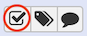

# Workflow upload

Same as data libraries, you can import workflows, from shared data that has been pre-set in your Galaxy server for this training session.

To access these workflows :

----
  
  
  1. Click the menu `Données partagées` (`Shared data`) and select the submenu
  `Workflows`. You should see two workflows : `paired-data-STAR-RNAseq` and `paired-data-HISAT2-RNAseq`
  
  2. For each workflow, click on the arrow and select `Import`.

Now, you'll be able to see these workflows in the `Workflow` menu.

----

# Running workflows

You need to return to our first galaxy history `Inputs`, to do so :

----
  
  
  1. Click the menu `Utilisateur` and select the submenu
  `Historiques sauvegardés`.
  
  2. Click on `Inputs`. Its status is now **current history**. 

----

## Prepare inputs

These workflows use data collection as inputs, one per condition `treat` and `untreat`. Let's create our two data collections !

----
  
  
  1. Click on the checked box. 
  
  2. Select all treated datasets in pair ends :
      - `GSM461180_1_treat_paired.fastq.gz`
      - `GSM461181_1_treat_paired.fastq.gz`
      - `GSM461180_2_treat_paired.fastq.gz`
      - `GSM461181_2_treat_paired.fastq.gz`
  
  3. Then click on the button `Pour toute la sélection...` and `Build List of Dataset Pairs`.
  
  4. Enter a name for your dataset collection. `Name`: Treat data pairs. 
  
  5. `Create list`

----

  Redo a data collections for untreated datasets.
  
  1. Unchecked the previous datasets.
  
  2. Select all untreated datasets in pair ends :
      - `GSM461177_1_untreat_paired.fastq.gz`
      - `GSM461178_1_untreat_paired.fastq.gz`
      - `GSM461177_2_untreat_paired.fastq.gz`
      - `GSM461178_2_untreat_paired.fastq.gz`

  3. Then click on the button `Pour toute la sélection...` and `Build List of Dataset Pairs`.
  
  4. Enter a name for your dataset collection. `Name`: Untreat data pairs. 
  
  5. `Create list`

----

You are now the happy owner of two dataset paired collections ! 

It's time to test the worflows !

----
  
  
  1. Go to Menu `Workflow`.
  
  2. For the workflow `imported: paired-data-HISAT2-RNAseq`, click on the arrow and then `Run`.
  
  3. `History Options`
      - `Send results to a new history`: Yes
  
  4. `1: treated data pairs`: Treat data pairs
  
  5. `2:GTF`: Drosophila_melanogaster.BDGP6.95.gtf.gz
    
  6. `3: un-treated data pairs`: Untreat data pairs
  
  7. `Run workflow`

----

  Redo the same for the workflow `imported: paired-data-STAR-RNAseq`.
