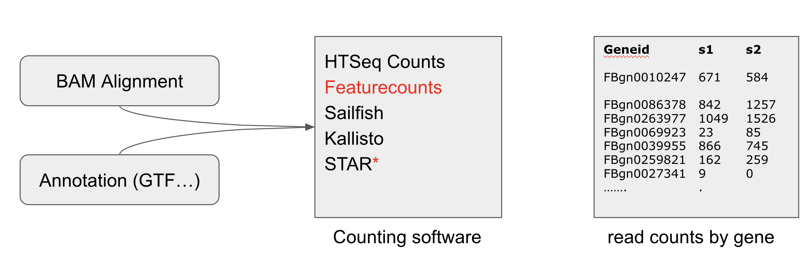

#  Transcript Quantification

Note that we use absolute read counts because we are going to compare counts across samples.

Other metrics for comparison of genes within the same sample are:

- CPM (Counts Per Million) Each gene count is divided by the corresponding library size (in millions).
- RPKM (reads per kilobase of exons per million mapped reads)
- TPM	 (Transcript per Million)
    
    -----
    1. Divide the read counts by the length of each gene in kilobases. This gives you reads per kilobase (RPK).
    2. Sum up all the RPK values in a sample and divide this number by 1,000,000. This is your “per million” scaling factor.
    3. Divide the RPK values by the “per million” scaling factor. This gives you TPM
    -----