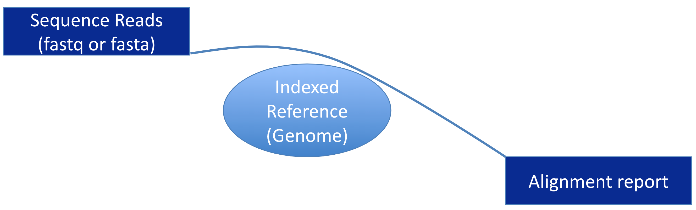

## [Bowtie](http://bowtie-bio.sourceforge.net/) align reads on _indexed_ genomes

{width="600"}

## Preliminary Note :warning:
For the following steps, you will need 2 programs which
an admin (with admin rights) has already installed - system-wide - for you, using the
following command:

```
sudo apt update && apt install -y bowtie samtools
```

## Prepare dmel_r6.54 bowtie index (*Drosophila* genome)

!!! note "Bowtie indexing command line"
    ```
    bowtie-build --threads 6 dmel-all-chromosome-r6.54.fasta dmel.r6.54
    ```
:clock230: This step should take about 2-3 min

## Align the clipped fasta reads to dmel.r6.54 using `bowtie`
```
bowtie dmel.r6.54 -f clipped_GRH-103_R1.fasta \
                       -v 0 \
                       -k 1 \
                       -p 3 \
                       --al dmel_matched_GRH-103.fa \
                       --un unmatched_GRH-103.fa \
                       -S > GRH-103.sam
```
:clock230: This step should take about 1 min

??? info "The bowtie alignment command explained"
    - `bowtie dmel.r6.54 -f clipped_GRH-103_R1.fasta` # tells bowtie where is the index and the input clipped_GRH-103_R1.fasta
    - `-v 0 -k 1 -p 3` # These are bowtie options
    - `--al dmel_matched_GRH-103.fa` # aligned reads will be in the dmel_matched_GRH-103.fa file
    - `--un unmatched_GRH-103.fa` # Unaligned reads will be in the unmatched_GRH-103.fa file
    - `-S > GRH-103.sam` # tells bowtie to return an alignement file in SAM format (-S) -S > GRH-103.sam


## Convert SAM file to BAM file and sort the alignments by chromosome positions
```
samtools view -Sb -@ 3 GRH-103.sam | samtools sort -@ 3 -o GRH-103.bam
```
Check the result using
```
samtools view GRH-103.bam | more
```
