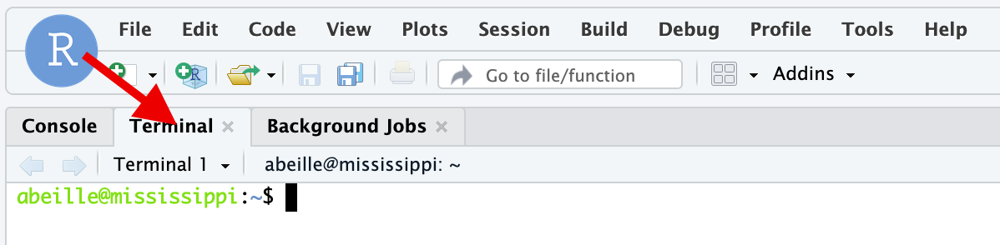
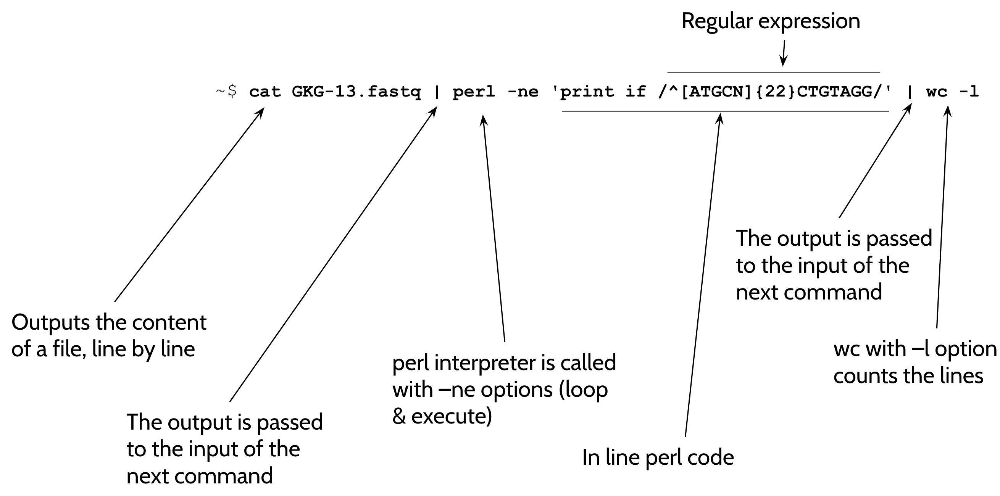

{width="150"}

## 1. SSH connection to a linux terminal in the analysis server

We are going to use an Rstudio server. As its name indicates, the primary purpose of Rstudio
is to provide an interactive R console for R coding.
However, the Rstudio server also provides a graphical interface to a LINUX terminal and
this is this interface we are going to take advantage of !

:warning: The students are split in two groups. One group will use a serveur deployed in the Google
cloud, whereas the other group will use a serveur deployed in the Jussieu campus.

- First of all, visit this [Page](https://docs.google.com/spreadsheets/d/14Urisfz_44Ax_BPccESKAfqGRiVlePUMsyQnE5P4U4c/edit?usp=sharing)
and reserve an account by putting you email adresse in the
corresponding row.

:warning: Please only one account by student.

- Once this is done, copy the server address indicated for your account and paste it in your
web browser (in a new tab).

- On the Rstudio login page, enter your login and your password

- just click the `Terminal` tab as shown below.



- Pull the central separation toward the right handside of the screen to enlarge your terminal.

Your are ready to work using command lines on your server !

You are connected to your `home` directory, which is also symbolised by `~`.
Your "prompt" - the text just before the command typing area - is constructed as follows:
```
abeille@mississippi:~$
```
where, for instance here, `abeille`is the login, `mississippi` is the name of the machine,
and the path is `~`, ie your home directory.

:warning: For the rest of the training, the commands will be always indicated in command
fields (the grey box with a copy/paste icon in the upper right corner), *without* the `prompt`.

## 2. Basic "navigation"

- Type (or copy and paste)
```
pwd
```
in your terminal and press ++enter++.

??? question "What do you read ?"
    you see the full path of your current position in your file system. `pwd` stands for
    **print working directory**
    
    You should be in `/home/<user name>` !

- Type (or copy and paste)
```
ls -la
```
++enter++
??? question "What do you read ?"
    the `ls` command print the elements in your current (working) directory.
    
    you expect something very close to:
    ```
    total 24
    drwxr-xr-x  3 limace   limace   4096 Dec  7 23:58 .
    drwxr-xr-x 45 limace   limace   4096 Dec  8 00:38 ..
    -rw-r--r--  1 limace   limace    220 Feb 25  2020 .bash_logout
    -rw-r--r--  1 limace   limace   3771 Feb 25  2020 .bashrc
    drwx------  2 limace   limace   4096 Dec  7 23:58 .cache
    -rw-r--r--  1 limace   limace    807 Feb 25  2020 .profile
    ```
    Here, the options -la are formatting the output of `ls` in a certain way.
    
    If you want to know the options available for a command, type:
    ```
    man ls
    ```
    You can also try:
    ```
    ls
    ```
    alone and see how it affects the output of the command.

- Type (or Copy/Paste):
```
mkdir ~/bowtie_work && cd ~/bowtie_work
```
??? question "What have you done with this command ?"
    You have created a new directory `bowtie_work` in your home directory and, in the same
    command (because of the `&&`) you have changed you directory to `~/bowtie_work`
    
    You can try the command `pwd` and confirm that you are in the `/home/<yourlogin>/bowtie_work`
    directory.

- Type (or Copy/Paste):
```
wget https://ftp.flybase.net/genomes/dmel/dmel_r6.54_FB2023_05/fasta/dmel-all-chromosome-r6.54.fasta.gz \
     https://psilo.sorbonne-universite.fr/index.php/s/HYLtfo9d2eD3Q2A/download/GRH-103_R1.fastq.gz
```
??? question "the `wget` command"
    wget downloads files whose URL is indicated as argument.
    
    After wget, just check the presence of two new files, `dmel-all-chromosome-r6.54.fasta.gz`
    and `GRH-103_R1.fastq.gz` in your working directory, using the `ll` command.

- We need to uncompress the .gz files:
```
gunzip *.gz
```
??? question "What is it doing ?"
    the `GRH-103_R1.fastq.gz` and `dmel-all-chromosome-r6.54.fasta.gz` files are compressed files
    (format gzip), as indicated by their `.gz` extension.
    
    The gunzip command has uncompressed the files to `GRH-103_R1.fastq` and
    `dmel-all-chromosome-r6.54.fasta`, respectively.
    
    You can verify it by typing
    ```
    ll
    ```
    which should show:
    ```
    total 1545908
    drwxr-xr-x 2 limace limace       4096 Dec 13 21:51 ./
    drwxr-xr-x 6 limace limace       4096 Dec 13 21:49 ../
    -rw-r--r-- 1 limace limace 1437054065 Dec 13 21:49 GRH-103_R1.fastq
    -rw-r--r-- 1 limace limace  145942238 Dec 13 21:49 dmel-all-chromosome-r6.54.fasta
    ```
    :warning: as you may have deduced, the `ll` command is an _alias_ to the `ls -laF`
    command.

## 3. What is this fastq file containing ?

Type (or Copy/Paste):
```
GRH-103_R1.fastq
```
??? question "What is doing the `more` command ?"
    It reads the file by chunks of your screen size. Each time you type the ++space++ bar,
    you print the next chunk.
    To exit from this read mode, just press the ++q++ key.

??? question "How is made a fastq file ?"
    ```
    @HWI-D00104:246:C5N47ANXX:8:1101:6009:2000 1:N:0:CATTTT <-- Header
    NCTGATGTCGGTCACATGCTTGGTGGAATTCTCGGGTGCCAAGGAACTCC <-- Sequence
    +                                                  <-- Quality header
    #<<BBFFFFFFFFFFFFFFFFFFFFFFFFFFFFFFBBFFFFFFFFFFFFF <-- Sequence Quality (ASCII encoded)
    @HWI-D00104:246:C5N47ANXX:8:1101:1557:2014 1:N:0:CATTTT
    NGCAAGATGAATACTCTAATGACATGGAATTCTCGGGTGCCAAGGAACTC
    +
    #</<</BBFB<<FFFFFFFFFFFF/BF//<FF/FFFFFF<FFFFFBFFFF
    @HWI-D00104:246:C5N47ANXX:8:1101:1549:2052 1:N:0:CATTTT
    NGCCGTGATCGTCTAGTGGTTAGGATGGAATTCTCGGGTGCCAAGGAACT
    +
    #<</B/</FFFBFFFFFFFFFFFFFBFF/FFFFFFFFFFBFFFFFFFFFF
    ```
    One sequence read is encoded by a block of ==**4**== lines, 1 for the header (the name
    of the read), 1 for the nucleotide sequence, 1 starting with a `+` which may contain or not
    a copy of the header, and the last line for the quality of the base calling at each position,
    encoded by an ASCII character.

## 4. How many sequence reads in my file ?
Type (or Copy/Paste):
```
wc -l GRH-103_R1.fastq
```
!!! info "the `wc` command"
    prints the number of newlines, words, and bytes for each file in argument (here,
    GRH-103_R1.fastq)
    
    :warning: As you used the `-l` option, you only print the number of *newlines* in the
    file.

??? question "And then... How many _**sequences**_ in GKG-13.fastq ?"
    
     **8 898 789**, NOT 35 595 156, because each sequence read is encoded by 4 lines !

## 5. Are my sequence reads containing the adapter ?

This fastq file corresponds to the sequencing of a small RNA library, whose 3' adapter
contains the sequence 5’-**TGGAATT**CTCGGGTGCCAAGTGGAAT-3’
Type (or Copy/Paste):
```
cat GRH-103_R1.fastq | grep TGGAATT | wc -l
```
This should return:
```
8 829 013
```

??? Question "A lot of things to comment in the previous command !"
    - `cat` print the _total_ content of the file in argument
    - the sign ++pipe++ is important, we call it the `pipe`. the `|` takes the ==output== of
    the _upstream_ command (here `cat GRH-103_R1.fastq`) and gives it as ==input== to the
    downstream command (here `grep TGGAATT`).
    - `grep` prints the lines of the input (or of the argument if used without pipe) _only_ if
    these lines contains the string `TGGAATT`.
    - the second pipe `|` sign sends the output of the grep command and counts the number
    of lines in _this_ output.
    
    Brillant isn't it ?

### Why doing it simple when you can do it complicated ?

Yeah... As a matter of fact, you can obtain exactly the same information from `GRH-103_R1.fastq`
by typing (or copying and pasting) the command:
```
grep -c "TGGAATT" GRH-103_R1.fastq
```

:warning: Here, the option -c is passed to `grep` to ask for only counting and not _printing_
the lines that contain the string pattern `TGGAATT`

Check it out !

### We need a negative control

The implicit hypothesis in the previous computing was that the number of reads with 7-nucleotide string
of the adapter sequence is closely reflecting the number of reads with the "real" adapter.

This seems reasonable since the probability to find by chance this 7-nucleotide string in
a read that _does not_ contain the adapter is approx. 1/ 4^7 = 6.103516e-05.

However, it is preferable to experiment a negative control.

To find the number of sequences containing the "random" 7-nucleotide sequence `ATCTCCT`, type:

```
grep -c "ATCTCGT" GRH-103_R1.fastq
```

If everything goes well, you should find `7 853`.

You see that 7 853 divided by 8 829 013 total reads in the fastq file is 8.89e-04, which is
not too far from our *a priori* assertion.

### conclusion on the counting

We found 8 829 013 out of 8 898 789 with the adapter sequence, which corresponds to 99.2 %
sequences with adapters. The library seems to be OK !

## 6. Advanced combinations of bash commands.

In a first example we are going to compute the number of reads that :

- are 22 nucleotides long
- _and_ contain a 3' flanking adapter sequence `TGGAATT`.

To do so, type:
```
cat GRH-103_R1.fastq | perl -ne 'print if /^[ATGCN]{22}TGGAATT/' | wc -l
```

You should obtain **988 421** as a result.

??? question "Why did we choose **{22}** in the previous example ?"
    22 nt is the major length of miRNAs...

And now, a figure to explain the complex above command (arguments have changed but the
syntax is the same):

{ width="800"}

### Toward adapter soft clipping
Before moving on in the analysis, we will have to remove the adapter sequences from the
read sequences. Let's first execute this command:

```
cat GRH-103_R1.fastq | perl -ne 'if (/^(.+TGGAATT)/) {print "$1\n"}' | more
```
??? question "What is showing the output of this command ?"
    The read sequences containing the adapter (in first approximation)

And now, in a single command, let's generate a file, in fasta format, with the sequences
which did contain the adapter sequence **but** whose this sequence was **removed** from
the reads:

```
cat GRH-103_R1.fastq | perl -ne \
'if (/^([GATC]{18,})TGGAATT/){$count++; print ">$count\n"; print "$1\n"}' \
> clipped_GRH-103_R1.fasta
```

??? question "What is the character ++"\"++ in the command "block" ?"
    It is a continuation mark: The shell is waiting for the command to be continued on the
    next line.
    If you don't get it, try to type and ++return++ the command:
    ```
    cat GKG-13.fastq | perl -ne \
    ```
    ... and if you are stuck, try ++ctrl+"C"++ ;-)

To observe to result of the previous command, type and ++return++:
```
ll
```

??? question "What are you going to use as a command to look at the generated clipped_GKG13.fasta file ?"
    Something like:
    ```
    cat clipped_GRH-103_R1.fasta | more
    ```
    or simply:
    ```
    less clipped_GRH-103_R1.fasta
    ```
    and type ++q++ to exit from the read mode !

