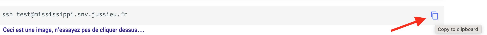

Ce cours comporte une très large partie pratique, dont le but est:

- Au cas où cela serait nécessaire, de démystifier l'interaction d'un biologiste avec un
serveur informatique par lignes de commandes.

- De vous faire découvrir l'environnement web d'analyse bioinformatique
  [Galaxy](https://galaxyproject.org)

Les points suivants sont requis pour pouvoir effectuer correctement les parties
pratiques de ce cours:

## 1. Un ordinateur portable
Comme nous n'avons malheureusement pas pu disposer d'une salle équipée de postes informatiques,
vous devrez disposer d'un ordinateur portable équipé de:
`Windows`, `MacOS` ou `Linux`.

- [x] une batterie ==chargée==
- [x] un système d'exploitation `Windows`, `MacOS` ou `Linux`
- [x] au moins un navigateur (ou deux, c'est un **plus**) parmi `Chrome`, `Firefox`, `Safari`
  ou `Opera`.
- [x] équipé d'une interface réseau WiFi fonctionnelle.

## 2. Une connexion réseau fonctionnelle

Il est préférable que vous ayez déjà ==testé== sa stabilité sur le campus.

Suggestions de réseaux:

- [x] **eduoram**. En tant qu'étudiant.e.s vous devriez avoir un accès simple (?) à ce réseau WiFi.
      Vous trouverez **[ici](https://hotline.sorbonne-universite.fr/front/knowbaseitem.form.php?id=191)**
      des informations utiles pour réussir une connexion à la suite d'une mise à jour de
      eduoram le 25 novembre dernier.
- [x] **eduspot** (sans conviction)
- [x] Un partage de connexion 4G avec votre smartphone (c'est probablement la solution que
      j'adopterai)

## 3. Un programme "client SSH (**S**ecure **SH**ell)"

- [x] Si vous avez déjà utilisé un programme client ssh pour vous connecter à un terminal
  unix distant avec votre machine, ne changez rien !
- [x] Si votre système est `Windows`, vérifiez que le programme `PuTTY` est installé et
  dans le cas contraire, installez le (https://www.putty.org/).
- [x] Si votre système est MacOS ou une distribution Linux, trouvez et ouvrez le programme
  "Terminal".
- [x] Si aucune des solutions précédentes ne fonctionne, vous pouvez, _en dernier ressort_,
  installer l'extension ==`Secure Shell App`== (menu Fenêtre --> Extensions) dans votre navigateur
  `Chrome`, ou l'extension ==`SSHgate client SSH et émulateur de terminal`== (menu `Extentions
  et Thèmes`) dans votre navigateur `Firefox`.

Grâce à ces programmes "Clients SSH", vous pourrez ouvrir un terminal et accéder en ssh au
serveur de calcul depuis votre navigateur.

## 4. TESTEZ votre connexion ssh sur un serveur "bac à sable"

Pour tester que vos connexions ssh s'opère depuis votre portable, merci de copier la
commande suivante dans votre programme client ssh, en entrant le mot de passe qui vous aura
été communiqué par mail. (Vous devrez validez avant l'authentification de l'empreinte de ce
serveur en entrant "yes" quand cela vous sera demandé).

!!! tip "vous pouvez copier le contenu d'un champ de code, tout au long de ce document, en cliquant sur l'icone en haut à droite du champ"
    
    

```
ssh test@mississippi.snv.jussieu.fr
```

**Puis**, entrez la commande suivante pour enregistrer votre connection, en remplaçant la
partie `<Prenom Nom>` par... votre prénom et votre nom, **sans enlever les guillemets**:

```
echo "<Prenom Nom>" >> user_log.txt
```

**Enfin**, déconnectez-vous, soit en entrant la commande `exit`, soit en refermant votre
programme client ssh (ou sa fenêtre de connexion).
