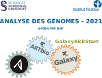

------

# News

!!! info "2021-11-14"
    ## The Galaxy Training [Run Galaxy](Run-Galaxy/index.md) is upgraded
    
    In preparation of the training "Analyse des Génomes" which will be held during the
    week of November 29th, 2021
    
    
{ width=400 }

!!! info "2021-11-15"
    ## FIDLE - Formation d'Introduction au Deep Learning
    
    Cette formation sera proposée, comme lors de la première édition, en distanciel,
    ouverte à tous et sans inscription, sous forme de séquences courtes de 2h à 3h,
    les jeudi à 14h, de fin novembre 2021 à avril 2022.
    
    ### C'est quoi, pour qui ?
    
    L'objectif est de proposer une introduction au deep learning, accessible à un
    large public scientifique, abordant à la fois les concepts fondamentaux que des
    exemples d'usages ou d'architecture plus avancés (VAE, Transformers, GAN, ...).
    Chaque séquence sera illustrée d'exemples pratiques (notebooks jupyter).
    
    Des attestations de présence pourront être délivrés aux doctorants pour
    les écoles doctorales, à l'issue de chaque séquence(1).
    
    ### N'hésitez pas a relayer et diffuser cette annonce !
    
    C'est quand ?
    
    La première séquence est prévue :
     
    **Jeudi 25 novembre 2021, à 14h00,**
    
    Les paramètres de diffusion seront précisés 48h avant.
    La fin de la saison est prévue mi avril 2022.
    
    #### Pour en savoir plus :
    
    Présentation et programme : https://fidle.cnrs.fr
    Contact : fidle.contact@grenoble.cnrs.fr
    
    
    **Cette action est portée par la MITI du CNRS, via le réseaux DevLOG et Resinfo/SARI,
    avec le soutien et la participation de l’IDRIS, de la formation permanente CNRS et des
    instituts 3IA, MIAI et ANITI, de l'Université Grenoble Alpes et le mésocentre GRICAD.**
    
    En vous attendant nombreuses et nombreux !
    
    **Jean-Luc Parouty, pour l'équipe Fidle**
