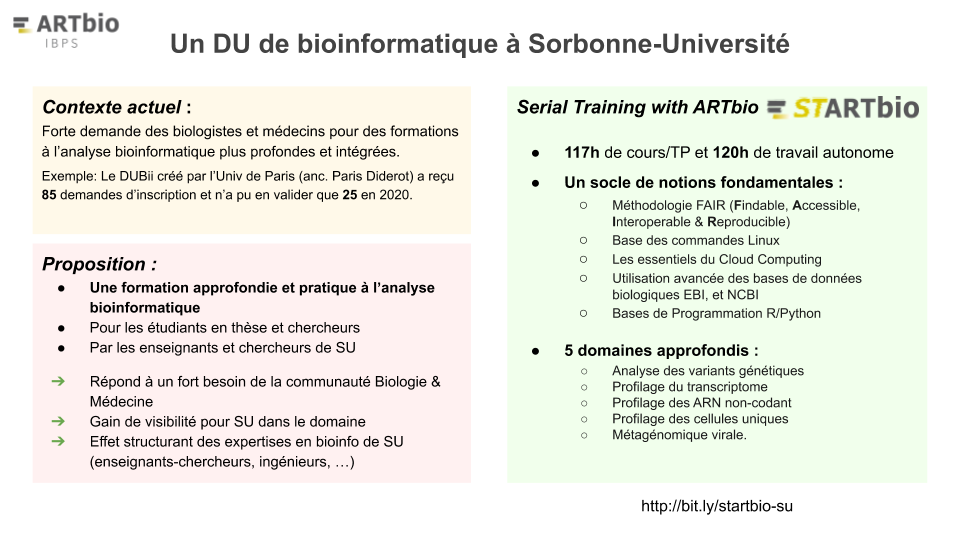

------

# ==Information et outils en confinement Covid-19==
### [Les Septs Samouraïs du télé-travail](Covid-19/sept-samouraïs.md)
### [Les solutions de visio-conférences](https://docs.google.com/document/d/1tKPEK71cIgny70yEWkH7HDHRwykgo_zq9iVaHUAt6YE/edit?usp=sharing)
### [Le traitement de texte collaboratif](Covid-19/shared_text_editors.md)

-------

{: style="width:900px"}

### [Detailed information on the STARTbio project](Curamus_project/)

## News Formations

!!! info "MOOC BIG "BioInformatique pour la Génétique Médicale""
    Le MOOC BIG "BioInformatique pour la Génétique Médicale" a été réalisé à l'initiative de Julien Thevenon, Kevin Yauy et Evan Gouy avec, entre autres, le soutien du CNEPGM.
    Ce MOOC traite de la bio-informatique dans le domaine de la génétique médicale. Il peut vous intéresser ou intéresser des membres de vos équipes.
    
    Un forum y est dédié aux échanges entre apprenants. Un objectif sous jacent de ce MOOC est de participer à fédérer la communauté française de bioinformatique appliquée à la génomique médicale.
    
    Ouverture des inscriptions du MOOC
    
    Les inscriptions pour le MOOC ont débutées le 30 décembre dernier. Le début des cours aura lieu le 24 février pour 6 semaines  de plein régime et une fermeture effective au 4 mai. 
    
    Il est accessible ici :
    
    [https://www.fun-mooc.fr/courses/course-v1:USPC+37028+session01/about](https://www.fun-mooc.fr/courses/course-v1:USPC+37028+session01/about)

    La “bande annonce” est également accessible via Youtube :
    
    [https://www.youtube.com/watch?v=UvQcNjuBW88](https://www.youtube.com/watch?v=UvQcNjuBW88)
