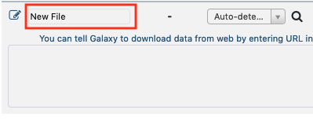

We are now entering into real analyses using Metavisitor.
These analyses as well as their biological context are presented as **Use Cases** in the [metavisitor article](http://dx.doi.org/10.1101/048983). We invite readers of this manual to refer to this article if they need to better understand the biological context of the described procedures.

In this section, we are going to create step by step a Galaxy history that contains the input data required to run the workflows for Use Cases 1-1, 1-2, 1-3 and 1-4.

---
#### Detection of known viruses

Using small RNA sequencing libraries SRP013822 (EBI ENA) and Metavisitor workflows, we are going to reconstruct Nora virus genomes.

- Workflow for Use Case 1-1:

    Takes the raw reads and collapses them into unique sequences to reconstruct a Nora virus genome referred to as Nora_MV

- Workflow for Use Case 1-2:

    Takes raw reads and reconstructs a Nora_raw_reads genome

- Workflow for Use Case 1-3:

    Takes raw reads, normalizes the abundances and reconstructs a Nora_Median-Norm-reads genome

In order to show Metavisitor's ability to detect multiple known viruses we'll use an other workflow with SRP013822 sequences.

- Workflow for Use Case 1-4:

    Takes raw reads, assembles contigs and aligns them against **vir2**

---
# History with input data for Use Cases 1-1, 1-2, 1-3 and 1-4

1. Create a new history and rename it "Input data for Use Cases 1-1, 1-2, 1-3 and 1-4"
2. Get SRP013822 datasets list
    - Use the the tool `Upload File` and click on the `Paste/Fetch data` button

        Copy - Paste the following text (not including the header):

        SRR id|
        ------|
        SRR515090|
        SRR513993|
        SRR513992|
        SRR513990|
        SRR513989|
        SRR513981|
        SRR513901|

    - Edit the file name by clicking the "New File" section and writing "use_case_1_accessions"    or by selecting the `Start` button and changing the file name.
3. Import SRP013822 datasets
    - Use the tool `Extract reads in FASTQ/A format from NCBI SRA` and select in the `select input type` list `List of SRA accession, one per line`.
    - Select in the `sra accession list` the `use_case_1_accessions` file and run the tool.
4. Rename a dataset collection **SRP013822**
    - Click on the `Single-end data (fastqdump)` collection
    - Click on the title "Single-end data (fastqdump)" and rename it "SRP013822"
    - You can delete the `Pair-end data (fastq-dump)` collection by clicking the `X` button and selecting "Collection Only".

5. Copy the vir2 blast nucleotide database that we prepared earlier in the [Reference](metavisitor_configure_references.md#3-prepare-blast-databases) history.
    - To do so, click on the little wheel icon in the history top menu (in the history right bar).

    

    - Select "Copy Datasets"
    - In the open page, select "References" in the Source History menu, check the "nucleotide vir2 blast database" dataset; select "Input data for Use Case 1_1, ..."; and click the "Copy History Items".
    - If you refresh the history, you will see the "nucleotide vir2 blast database" dataset showing up.

That is all for the moment. We will latter add datasets in the history `Input data for Use Cases 1-1, 1-2, 1-3 and 1-4`. However, these datasets do no exist yet: this will be produced by the Use Cases 1-1, 1-2, 1-3 workflows !
