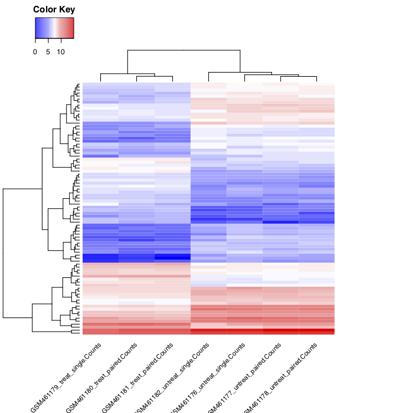

# Visualisation of differential expression

Now we would like to extract the most differentially expressed genes due to the treatment,
and then visualize them using an heatmap of the normalized counts and also
the z-score for each sample.

We will proceed in several steps:

- Extract the most differentially expressed genes using the DESeq2 summary file
- Extract the normalized counts for these genes for each sample, using the normalized count file generated by DESeq2
- Plot the heatmap of the normalized counts
- Compute the Z score of the normalized counts
- Plot the heatmap of the Z score of the genes

## Extract the most differentially expressed genes

----

1. Select the tool `Filter data on any column using simple expressions` to extract genes with a significant change in gene expression (adjusted p-value below 0.05) between treated and untreated samples:
    1. `Filter`: the DESeq2 result file
    2. `With following condition`: c7<0.05

The file with the independent filtered results can be used for further downstream analysis
as it excludes genes with only few read counts as these genes will not be considered as significantly differentially expressed.

The generated file contains too many genes (632/STAR, ) to get a meaningful heatmap. Therefore, in the next step,
we will take only the genes with an absolute fold change > 2 (log2(fold change) > 1)

----

1. Select the tool `Filter data on any column using simple expressions`
    1. `Filter`: the differentially expressed genes (output of previous `Filter` tool)
    2. `With following condition`: abs(c3)>1

We now have a table with 84/STAR, /HISAT2 lines corresponding to the most differentially expressed genes.
And for each of the gene, we have its id, its mean normalized counts (averaged over all
samples from both conditions), its log2FC and other information.

We could plot the log2FC for the different genes, but here we would like to look at a
heatmap of expression for these genes in the different samples. So we need to extract the
normalized counts for these genes.

We will join the normalized count table generated by DESeq2 with the table we just generated,
to conserve only the lines corresponding to the most differentially expressed genes.

## Extract the normalized counts of the most differentially expressed genes

----

- Create a Pasted Entry from the header line of the Filter output:

    1. Copy the header of the final Filter output
    2. Using the Upload tool select Paste/Fetch data and paste the copied data
    3. *Set the Type to tabular* and select Start to upload a new Pasted Entry

----

- Concatenate datasets tool to add this header line to the Filter output:
    1. select the `Concatenate datasets tail-to-head` tool
    2. select the Pasted entry dataset
    3. `+ Insert Dataset`
    4. select the final `Filter output`
    
This ensures that the table of most differentially expressed genes has a header line and can be used in the next step.

----

- join the normalized count table generated by DESeq2 with the table we just generated,
to conserve only the lines corresponding to the most differentially expressed genes

    1. select the `Join two Datasets side by side on a specified field` tool
        - `Join`: the Normalized counts file (output of DESeq2 tool)
        - `using column`: Column: 1
        - `with`: most differentially expressed genes (output of the Concatenate tool tool)
        - `and column`: Column: 1
        - `Keep lines of first input that do not join with second input`: No
        - `Keep the header lines`: Yes
        
The generated file has more columns than we need for the heatmap. In addition to the columns
with mean normalized counts, there is the log2FC and other information.
We need to remove the extra columns.

----

- Cut tool to extract the columns with the gene ids and normalized counts:

    1. Select the `Cut columns from a table`tool
        - `Cut columns`: c1-c8
        - `Delimited by`: Tab
        - `From`: the joined dataset (output of Join two Datasets tool)
        
We now have a table with 85 lines (the most differentially expressed genes)
and the normalized counts for these genes in the 7 samples.

----

- Plot the heatmap of the normalized counts of these genes for the samples

    1. Select the `heatmap2` tool to plot the heatmap:
        - `Input should have column headers`: the generated table (output of Cut tool)
        - `Data transformation`: 	**Log2(value+1)** transform my data
        - `Enable data clustering`: Yes
        - `Labeling columns and rows`: Label columns and not rows
        - `Coloring groups`: Blue to white to red
        
You should obtain something similar to:

