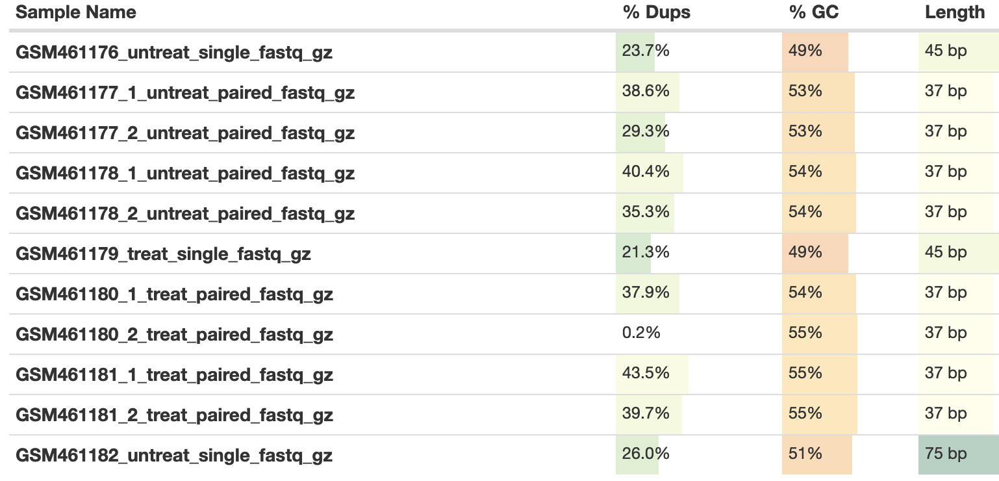
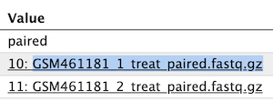
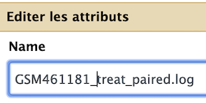

# RNA STAR (option for 50 % of attendees)

For information to set proper value for STAR parameters:

----

  1. create a new history and name it `RNA STAR`
  2. Import the 11 datasets from the RNAseq data library to this `RNA STAR` history, plus the Drosophila_melanogaster.BDGP6.95.gtf file
  3. Select the `RNA STAR` tool with the following parameters to map your reads on the reference genome:
      1. `Single-end or paired-end reads`: Single-end
      2. `RNA-Seq FASTQ/FASTA file` (multiple datasets button), Cmd-shift Select:
          - `GSM461176_untreat_single.fastq.gz`
          - `GSM461179_treat_single.fastq.gz`
      3. `Custom or built-in reference genome:` Use a built-in index
      4. `Reference genome with or without an annotation:` use genome reference without builtin gene-model
      5. `Select reference genome:` Drosophila Melanogaster (dm6)
      6. `Gene model (gff3,gtf) file for splice junctions:` the imported Drosophila_melanogaster.BDGP6.95.gtf
      7. `Length of the genomic sequence around annotated junctions:` 44 (This parameter should be length of reads - 1, see above table from fastQC/multiQC analysis)
  4. `Execute`
----

  Redo the STAR run with

  **3.2**	 Select the `RNA STAR` tool with the following parameters to map your reads on the reference genome:
   `RNA-Seq FASTQ/FASTA file` (as multiple datasets), Cmd-shift Select:
          - `GSM461182_untreat_single.fastq.gz`
          
  **3.7**	 `Length of the genomic sequence around annotated junctions:` 74 (This parameter should be length of reads - 1, see above table from fastQC/multiQC analysis)

----

  Redo a last STAR run for paired-end datasets
  
  3. With the following parameters to map your reads on the reference genome:
      1. `Single-end or paired-end reads`: Paired-end (as multiple datasets)
      2. `RNA-Seq FASTQ/FASTA file, forward reads` (multiple datasets button), Cmd-shift Select:
          - `GSM461177_1_untreat_paired.fastq.gz`
          - `GSM461178_1_untreat_paired.fastq.gz`
          - `GSM461180_1_treat_paired.fastq.gz`
          - `GSM461181_1_treat_paired.fastq.gz
      3. `RNA-Seq FASTQ/FASTA file, forward reads` (multiple datasets button), Cmd-shift Select:
          - `GSM461177_2_untreat_paired.fastq.gz`
          - `GSM461178_2_untreat_paired.fastq.gz`
          - `GSM461180_2_treat_paired.fastq.gz`
          - `GSM461181_2_treat_paired.fastq.gz
      3. `Custom or built-in reference genome:` Use a built-in index
      4. `Reference genome with or without an annotation:` use genome reference without builtin gene-model
      5. `Select reference genome:` Drosophila Melanogaster (dm6)
      6. `Gene model (gff3,gtf) file for splice junctions:` the imported Drosophila_melanogaster.BDGP6.95.gtf
      7. `Length of the genomic sequence around annotated junctions:` **36** (This parameter should be length of reads - 1, see above table from fastQC/multiQC analysis)
  4. `Execute`

## Rename your datasets !

----

You need now to rename you datasets to facilitate your downstream analysis.

Be quiet and focus ! No hurry, this is an *important task* in the analysis.

1. Search and select datasets with RNA STAR 

2. Click on the info icon  of both `log` and `bam` files

3. Copy the name or one of the two names of the datasets as shown bellow

4. Now click on the pencil icon of the *_same_* dataset

5. Paste your text in the `Name` field of the dataset

6. Edit your text as follow for `log` files

7. Edit your text as follow for `bam` files

8. repeat _ad lib_ for all `log` and `bam` files 

