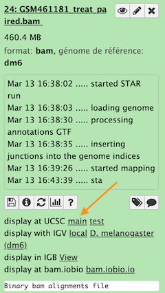

# Inspection of the mapping results

----
## UCSC genome browser  

click the ucsc main link as indicated by the orange arrow

Zoom to chr4:540,000-560,000 (Chromosome 4 between 540 kb to 560 kb)

## IGV  

To use IGV with galaxy you need to have this tool on your computer. (If not you can download IGV from [their main site](http://software.broadinstitute.org/software/igv/).)

1. Open locally IGV
2. click the IGV local ling as indicated by the red arrow.

Zoom to chr4:540,000-560,000 (Chromosome 4 between 540 kb to 560 kb)

----

