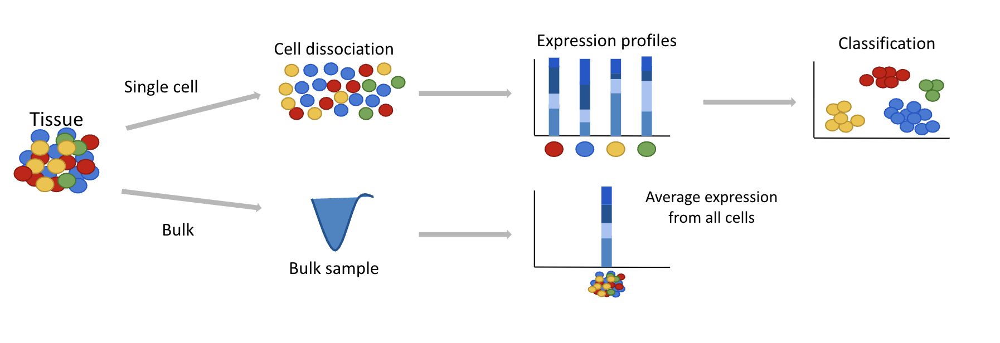
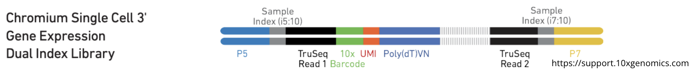
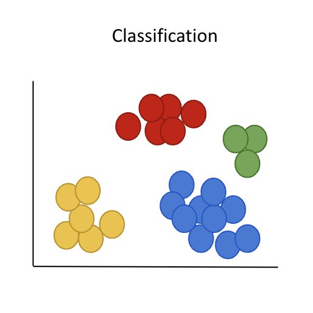
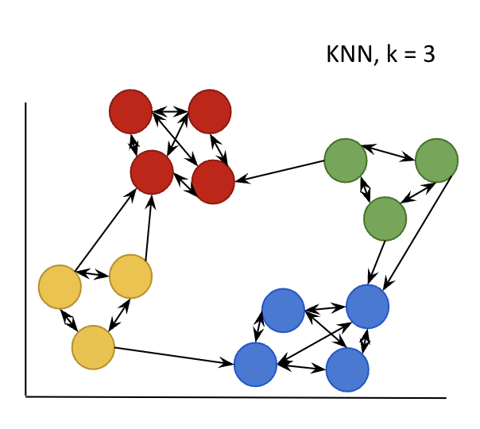
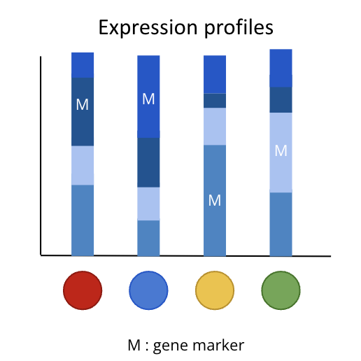

# Introduction to Single-Cell RNAseq analysis : From fastQ to identified populations

Single-cell RNAseq reveals tissue heterogeneity where bulk RNAseq can only demonstrate an average vision of a tissue transcriptome.

## FastQ files

The very first file format you can have is a fastQ file. It contains all sequences. For each sequence you will have the following four lines :

- Identifier line (begins with @)
- Sequence : contains different information based on the type of file :
    - R1 (barcodes sequence), R2 (cDNA sequences), I1 (illumina lane info)
- Quality score identifier line (consisting only of a +)
- Quality score for each base of the sequences

Here is an example of 10X library construction :

UMI (Unique Molecular Identifier) is a barcode sequence to identify and differentiate each mRNA molecules.

## Alignment and Counting

To obtain an expression matrix, you need to align the sequences to a reference genome and then count for each gene how many reads aligned on its sequence.

For technologies based on UMI (like 10X), you need to filter UMI duplicates thus avoiding PCR duplicates which is not possible for technologies such as Smartseq2 (that is more like bulk RNAseq methods).

There is a single-cell version of splice aware aligner STAR : RNAstarSolo. It need several inputs :

- FastQ files Read1 and Read2
- Reference genome (fasta file) and gene model (GTF)
- Cell Barcode whitelist

It will align the sequence to the reference genome going from fastQ file to Bam file (File format containing algined read). Then it will remove cell barcodes based on a list of known barcodes (the whitelist file provided by 10X for example) and filter UMI duplicates. Finally it will count producing an expression matrix.

!!! note
    There is a wrapper galaxy tool of [RNAstarSolo](https://toolshed.g2.bx.psu.edu/view/iuc/rna_starsolo/eec9494fdafa) with presets of different versions of CellRanger.

## Preprocessing

Once you have your expression matrix you need to clean data in order to not skew downstream analysis results.

- Remove low-quality cells :
    - You can filter cell based on :
        - Number of detected Genes
        - Aligned reads count
        - Percentage of mitochondrial genes
- Remove genes that don’t contain much information for reliable statistical inference
    - You can filter genes based on :
        - Number of cells that detect the specific gene
        - Select High variable genes
- Remove cell-specific biases :
    - Eliminate factors that prevent direct comparison of your cells :
        - gene length and/or library-size
- Remove batch effect :
    - Eliminate technical variations :
        - Different methods of integration, ex : Reciprocal PCA, Harmony

## High dimensional space

!!! example inline end "Schema of a dataset in 2 dimensional space"
    { width="300" }

Cells can be represented in as many dimensions as there are genes in the expression matrix, but finding similarities in high dimensional space is difficult. This is why we must reduce the dimensions !

There is multiples techniques such as :

- PCA : Principal Component Analysis
- t-SNE : t-Distributed Stochastic Neighbor Embedding
- UMAP : Uniform Manifold Approximation and Projection

## Clustering

!!! example inline end "Schema of kNN graph, for a SNN version retained only two-way arrows"
    { width="300" }

We can represent the dataset in a reduced and pertinent dimensional space and we are able to graphically visualize cell populations. With the help of classification algorithms, cell populations will be programatically defined.

1. Nearest Neighbors graphs (NN) based on the euclidean distance in PCA space. For each cell it find closest cells in their neighbouring. There is two kind of NN graphs :
    - kNN : find the k closest cells
    - SNN (Shared Nearest Neighbors) : find the k mutual closest cells
2. Cut edges based on resolution to obtain your clusters

## Gene Markers

!!! example inline end "Schema of expression profil specific for each cell population"
    { width="300" }

To identify what cell population the clusters are, you need to identify which genes characterise your clusters.
A gene marker is a gene whose expression is higher in a cluster than in the rest of the population.

- Differential expression analyses
    - Between a cluster vs the rest of the cells.
    - Between two clusters
- Gene annotation :
    - Biomart, GO, KEGG, Human Atlas…
