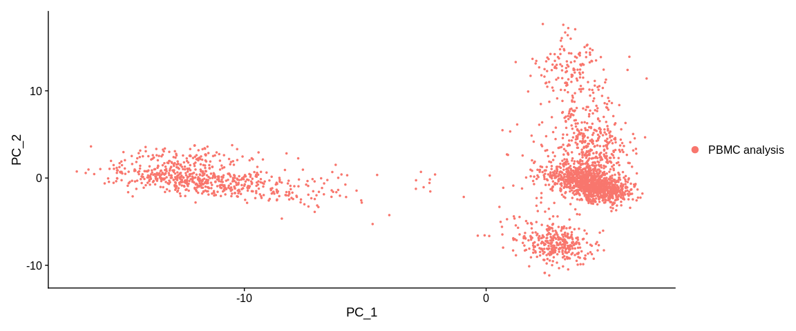

# Reduction of dimensionality

In order to identify groups of cells, we need to further reduce the
dimensional space in which the cells evolve. There are different methods
of dimension reduction that will help us to reach our goal: visualize and
identify cell populations in a low and relevant dimensional space. Here we
will see two methods, the first one is the principal component analysis
(PCA) and the second one which is based on the first one: the Uniform
Manifold Approximation and Projection (UMAP).

## Scaling Data

The first step is to perform a data scaling. This step is mandatory
to infer a PCA. The Seurat function `ScaleData` centers and reduces
the data by taking only the HVG by default. It is also possible to
provide it with a vector of variables to regress (most often we give
it the names of the columns in the `meta.data` slot of the variables
we want to regress).

$scaled.data(x) = \\frac{x - mean(x)}{ standard.deviation(x)}$

``` r
pbmc_small <- ScaleData(pbmc_small)
```

The slot `object@assays$RNA@scale.data` is now filled. It is a
dataframe of dimensions `n HVG x n cells` of reduced centered data.

## Principal Component Analysis (PCA)

A 2000 dimensional space is always too large to easily find
similarities and differences between cells. We will now use a dimension
reduction method called PCA. Briefly, the PCA will represent the point
cloud in the 2000 dimensions and then look for the angle that will allow
to split the cells on a plan as much as possible. The resulting dimensions
are called principal components (PCs) and are composed of a combinatorics of
the previous dimensions (the gene expressions).  

I recommend the videos of [Luis Serrano](https://www.youtube.com/watch?v=g-Hb26agBFg)
and [Josh Starmer](https://www.youtube.com/watch?v=FgakZw6K1QQ) that explain
step by step the PCA in image.

We will use the Seurat function `RunPCA`. For storage reasons, the `npcs`
parameter allows to keep in the seurat object only the first PCs, by default
the first 50.

``` r
pbmc_small <- RunPCA(pbmc_small,                 #SeuratObject
                     reduction.name = "pca",     #Name of the reduction stored in the reduction slot
                     npcs = 50,                  #Total Number of PCs to compute and store (50 by default)
                     seed.use = 42,              #Set a random seed. By default, sets the seed to 42.
                     verbose = TRUE)

## Graphic representation of cells
PCAPlot(pbmc_small,                              #SeuratObject
        dims = c(1, 2))                          #Dimensions (PCs) to plot, default is the first two
```



The slot `object@reductions$pca` is now created. It is an S4 object of
class `DimReduc` composed of several sub slots :

- `@cell.embeddings` : dataframe of the cell coordinates on the different PCs
- `@feature.loadings` : dataframe of the feature loadings (interpreted as the
  coefficients of the lineal combinatorial of the initial variables (the
  expression of the genes) from which the PCs are built)
- `@feature.loadings.projected` : dataframe of the projected feature
  loadings (empty)
- `@assay.used` : name of the assay used (here ``RNA``)
- `@global` : logic but no more description found on this slot
- `@stdev` : vector of standard deviation of stored PCs
- `@key` : prefix used to name the PCs, linked to the `reduction.key`
  parameter of `RunPCA`, default `PC_`
- `@jackstraw` : slot for Jack Straw analysis (currently empty)
- `@misc` : described as a slot for additional information (`total variance`)

The plot function represents our cells in the dimensional space of the first
two PCs of the PCA. By default the colorization of the cells is based on the
`active.ident` and thus for the moment, the `orig.ident` column of the
metadata.

## Uniform Manifold Approximation and Projection (UMAP)

We were able to reduce the dimensions to 50 but like the genes,
not all the principal components contain relevant information. We will
first select the PCs that will be used for the calculation of the UMAP
and the generation of clusters.  

### PCs selection

There are several methods to select the relevant PCs, here we will use the Jack
Straw method and the Elbow Plot.

#### Jack Straw Method

Seurat uses an adaptation of the [Jack Straw method](https://academic.oup.com/bioinformatics/article/36/10/3107/5788523).
The aim is to evaluate the robustness of the PCA by comparing the composition
of the PCs with that of PCs computed from permuted data.  

The `JackStraw` function will perform 100 permutations (default value of the
`num.replicate` parameter). At each permutation, it will randomly select 1%
of the most variable genes (default proportion, parameter `prop.freq`).
`JackStraw` will mix the values of the slot `object@assays$RNA@scale.data`
filter on these genes and then perform a PCA on this fake matrix.
From these results and for each PC, it calculates the number of times the
values of the fake loadings ($fakevals$) is greater than each value of the
observed loading ($trueval$), such as :

$Empirical.pval = \\frac{sum(fakevals > trueval)}{length(fakevals)}$

The `ScoreJackStraw` function uses the reduced variance test also called
$Z$ test (R function `prop.test`). It allows to test for each PC if the
probability that $Empirical.pval$ is greater than the threshold (parameter
`score.thresh`) is different from the expected proportion under a uniform
distribution of p-values.

``` r
## JackStraw : Determine statistical significance of PCA scores
pbmc_small <- JackStraw(pbmc_small,          #SeuratObject
                        reduction = "pca",   #Reduction to analyse
                        dims = 50,           #Number of dimension to analyse
                        assay = "RNA")       #Assay to use

## Compute Jackstraw scores significance.
pbmc_small <- ScoreJackStraw(pbmc_small,     #SeuratObject
                             dims = 1:50)    #Number of dimension to analyse
```

The results are contained in the slot `object@reductions$pca@jackstraw`,
it's an S4 object of class `JackStrawData` with different informations :

- `empirical.p.values` : dataframe of the p-values for each most variable
  gene (2000, in row) and each PCs (50, in column)
- `fake.reduction.scores` : dataframe of the loadings resulting from the
  PCA on the permuted data (2000 "genes" x 50 PCs)
- `empirical.p.values.full` : logic `NA`.
- `overall.p.values` : results of the p-values of the $Z$ test computed
  by the `ScoreJackStraw` function, one value per PC

``` r
## Representation JackStrow
JackStrawPlot(pbmc_small,                    #SeuratObject
              dims = 1:50)                   #Number of dimension to plot
```


We look for a *"jump"* in the values of the PCs. We usually try to recover
the PCs whose value is significant. Here we can stop at PC 10, because PC 11
has a value of 1e-4 and then the rest of the PCs just oscillate with values
equal to 1. If we want to be more stringent we can also select only the first
8 PCs because then the value increases and then decreases. The fact of being
more stringent allows us to reduce the background noise, on the other hand we
eliminate the possibility of observing more subtle similarities between our
cells.

#### Elbow plot method

This method consists in finding a *"bend"* in the distribution of the
standard deviations of the different PCs.

> I find this method much more complicated to decide how many PCs to keep.
> But it allows to have a second opinion, at choice I prefer to base myself
> on the Jack Straw result

``` r
ElbowPlot(pbmc_small,           #SeuratObject
          ndims = 20,           #Number of dimension to analyse
          reduction = "pca")    #Reduction to analyse
```


After visualizing the Elbow plot with 50 PCs, we reduced it to 20PCs because
it was too complicated to observe a bend. Here we could see a small jump in
the distribution between PCs 10 and 15 which would corroborate with the Jack
Straw results.

-> We can determine the choice of the number of PCs at **10**.

### UMAP Inference

Even if the PCA allows to reduce the dimensions and allow us to see groups of
cells, the UMAP method improves this signal. Indeed from the PCA coordinate
matrix, it will build a graph that represents our cells in an even smaller
dimensional space while keeping the global structure of our initial point
cloud.  

Summary of the method:

UMAP constructs a nearest neighbor graph in a smaller dimensional space.
The first step is the generation of a kNN (*k nearest neighbors*) graph.
The bigger k is, the more it preserves the global structure of our data.
On the contrary, a smaller k will better preserve the local structure. The
connections between our points (cells) are weighted according to the distance
between two points, the weight of the connection between two distant points
will be lower than between two close points. Then we project the cells
according to this weighted graph.

The UMAP is used more often than the t-SNE nowadays because the latter
represents the distances in a more complex way. UMAP allows to better
balance the global and local similarities compared to t-SNE (and it is
faster!).

`RunUMAP` is the Seurat function that allows us to generate a UMAP.
With the `dims` parameter we can tell it which PCs to keep.

``` r
pbmc_small <- RunUMAP(pbmc_small,               #SeuratObject
                      reduction = "pca",        #Reduction used to compute UMAP
                      reduction.key = "UMAP_",  #Dimension prefix
                      assay = "RNA",            #Assay to use
                      dims = 1:10)              #Number of PCs to keep (previously determined)

## Plot
UMAPPlot(pbmc_small)
```


The slot `object@reductions$umap` is now created. It is an S4 object of
class `DimReduc`, it is composed of several sub slots :

- `@cell.embeddings` : dataframe of the coordinates of the cells on the
  different components of the UMAP
- `@feature.loadings` : (empty for the UMAP)
- `@feature.loadings.projected` : (empty for UMAP)
- `@assay.used` : name of the assay used (here `"RNA"`)
- `@global` : logical but no more description found on this slot
- `@stdev` : (empty for UMAP)
- `@key`: prefix used to name PCs, linked to `reduction.key` parameter
  of `RunUMAP`, default `UMAP_`.
- `@jackstraw`: (empty for UMAP)
- `@misc` : described as a slot for additional information (empty)

The plot function represents our cells in the dimensional space of the first
two dimensions of the UMAP. By default the colorization of the cells is based
on the `active.ident` so the `orig.ident` column of the metadata. 
