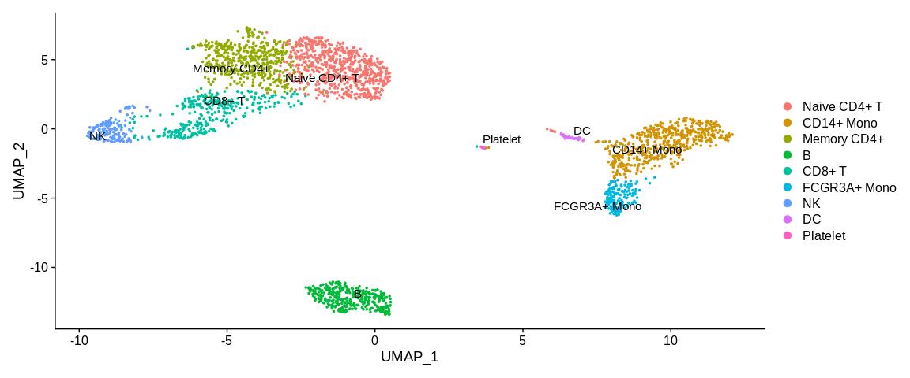
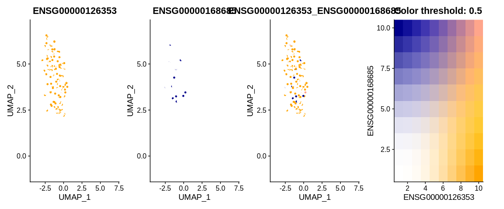

# Visualizations

There are many possible visualizations via Seurat:

- Point cloud of cells in a reduced dimensional space: 
    - `DimPlot` and the functions derived from it (`PCAPlot`,
      `UMAPPlot`, `TSNEPlot`) colour the cells with categorical 
      variables (clustering at different resolutions and other 
      columns in the metadata that would contain a variable with 
      discrete values)
    - `FeaturePlot` which colours cells according to continuous 
      variables (Gene expression, score, etc...)
- Violin plots which visualise cells according to continuous 
  variables (`VlnPlot`)
- Heatmap to visualise either expression levels or other continuous
  variables (`DoHeatmap`)
    - Be careful with the visualization because the slot 
      `object@assays$RNA@scale.data` is used so by default 
      we only have the information for the HVG. 
- The `DotPlot` which allows to visualize the expression of the 
  genes according to one or several genes for each of the cell 
  identities. It is in the form of a dot, larger or smaller depending 
  on the percentage of detection of the gene in the identity with a 
  colorimetry according to the average expression of the gene in the
  cell identity (here the different clusters)

There are many common parameters to these visualization functions: 

- `group.by`: a string vector containing one or more category variable(s) 
  used to colour the cells. This can be the name of a column in the metadata
- `split.by` : string of a category variable used to separate cells. By
  setting this parameter there will be a plot for each value of this 
  variable. This can be the name of a column in the metadata.
- `shape.by` : string of a category variable used to change the shape of
  cells. It can be the name of a column in the metadata.
- `features` : string vector containing one or more continuous variable(s)
  used to colour the cells. This can be the name of a column in the 
  metadata or the name of a gene in the expression matrix.
- `label`: this is a logic (TRUE or FALSE) that allows you to decide
  whether or not you want to add the names of `Idents(object name)` 
  to the plot. 
- `repel` : this is a logic that couples to `label` to prevent the names 
  of the groups of cells from being superimposed on the plot.
- `blend` : it is a logic which when using `FeaturePlot` with two genes 
  .allows to visualize in a third panel the co-expression of them
- `pt.size` : numerical value allowing to change the size of the point 
  on the plot.
- `cells` : string vector with the names of your barcodes of the cells 
  you want to visualize. By default all cells are plotted.
- `reduction` : string which allows you to select the chosen reduced 
  dimensional space present in the `object@reductions` slot. 

These are the main function parameters where you will find some practical 
examples below. I strongly encourage you to have a look at the 
documentation of each of these functions to see the range of possibilities
to allow you to make the figures you want.

``` r
## Visualize cells in UMAP coordinates where cells are colored by a certain clustering
UMAPPlot(pbmc_small,                                                           #SeuratObject
         group.by = "RNA_snn_res.0.4")                                         #Color cells based on different cell metadata
```


``` r
## Visualize cells in UMAP coordinates where cells are colored by two kind of variable separetely
UMAPPlot(pbmc_small,                                                           #SeuratObject
         group.by = c("RNA_snn_res.0.4", "RNA_snn_res.1.2"))                   #Color cells based on different cell metadata
```


``` r
## Visualize cells in UMAP coordinates where cells are splitted in different panels based on a variable
UMAPPlot(pbmc_small,                                                           #SeuratObject
         split.by = "RNA_snn_res.0.2")                                         #Separated cells based on a cell metadata variable
```


``` r
## Visualize cells in UMAP coordinates and adding cluster labels directly on the plot
UMAPPlot(pbmc_small,                                                           #SeuratObject
         label = TRUE,                                                         #Print cell identities directly on the plot
         repel = TRUE)                                                         #Avoid overlap of cell labels
```



``` r
## Dotplot to visualize target genes expression in the different cell identities
DotPlot(pbmc_small,                                                            #SeuratObject
        features = markers_pop$ensembl_gene_id,                                #Feature expression to plot
        cols = c("yellow", "red")) +                                           #Change expression color scale
  scale_x_discrete(labels = markers_pop$external_gene_name)                    #Change labels to print gene names instead of ensembl gene id
```


``` r
## Heatmap
DoHeatmap(pbmc_small,                                                          #SeuratObject
          features = markers_pop$ensembl_gene_id)                              #Feature expression to plot
```


``` r
## Visualize cells in UMAP coordinates where cells are colored by a continuous variable (here two expression genes)
FeaturePlot(pbmc_small,                                                        #SeuratObject
            features = c("ENSG00000126353", "ENSG00000168685"),                #Feature expression to plot
            cells = colnames(subset(pbmc_small, idents = "Naive CD4+ T")),     #Plot only Naive CD4+ T cells
            cols = c("white", "orange", "darkblue"),                           #Change color for the blend : first color : no expression, 2nd : expressed first gene, 3rd color : expressed gene 2
            blend = TRUE)                                                      #See the coexpression of the two genes
```



Visualising the `FeaturePlot` with `blend = TRUE` shows us 4 panels.
The first panel shows the expression level of gene 1, the second panel
shows the expression level of the second gene. The last two panels
allow us to understand the co-expression thanks to the colour matrix. 
If the cell expresses neither gene then it will appear white, if it 
expresses only the first gene then it will appear in a shade of orange
depending on the level of expression. Conversely, if it expresses only 
the second gene it will be a blue shade. And if it expresses both genes,
the colour it will take will be a mixture of orange, blue and white 
according to the balance between the two expression levels.
