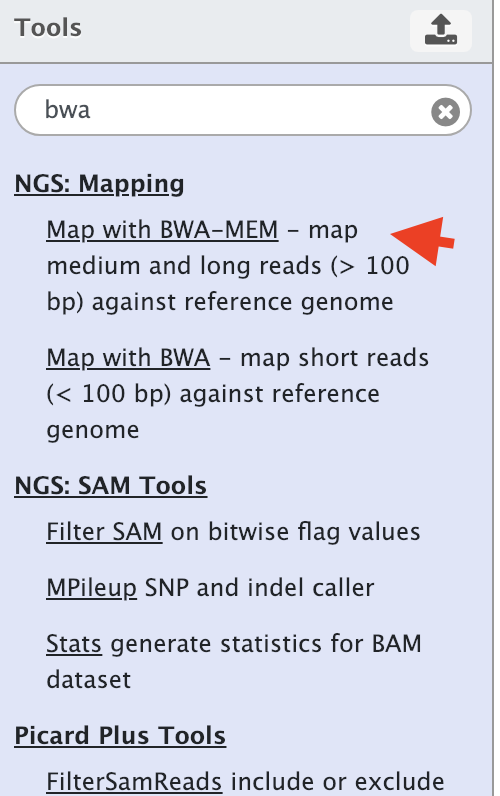
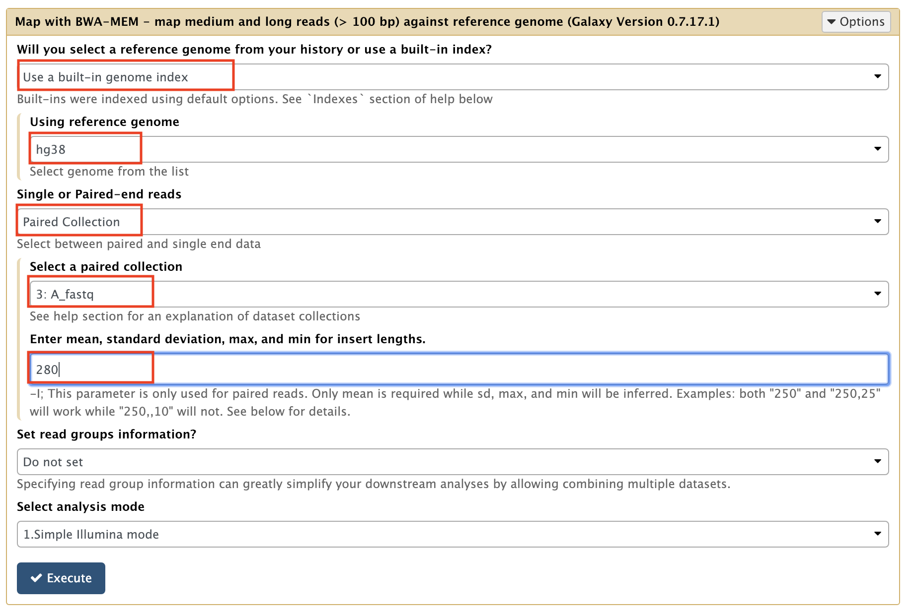

We are going to use the [BWA-mem aligner](https://www.ncbi.nlm.nih.gov/pubmed/20080505) to align reads to the human genome, version hg38.

1. Select the BWA-MEM tool in the Galaxy tool bar
    
    {: style="width:300px"}
    
2. Fill carefully the tool form

    !!! info "Map with BWA-MEM - map medium and long reads (> 100 bp) against reference genome (Galaxy Version 0.7.17.1)"
        - **Will you select a reference genome from your history or use a built-in index?**: `Use a built-in genome index`
        - **Single or Paired-end reads**: `Paired Collection`
            - **Select a paired collection**: `A or B collection`
            - **Enter mean, standard deviation, max, and min for insert lengths.**: `280`
        - **Set read groups information?**: `Do not set`
        - **Select analysis mode**: `1. Simple Illumina mode`
        
        This should give you a form similar to:
        

3. Click the `Execute` button