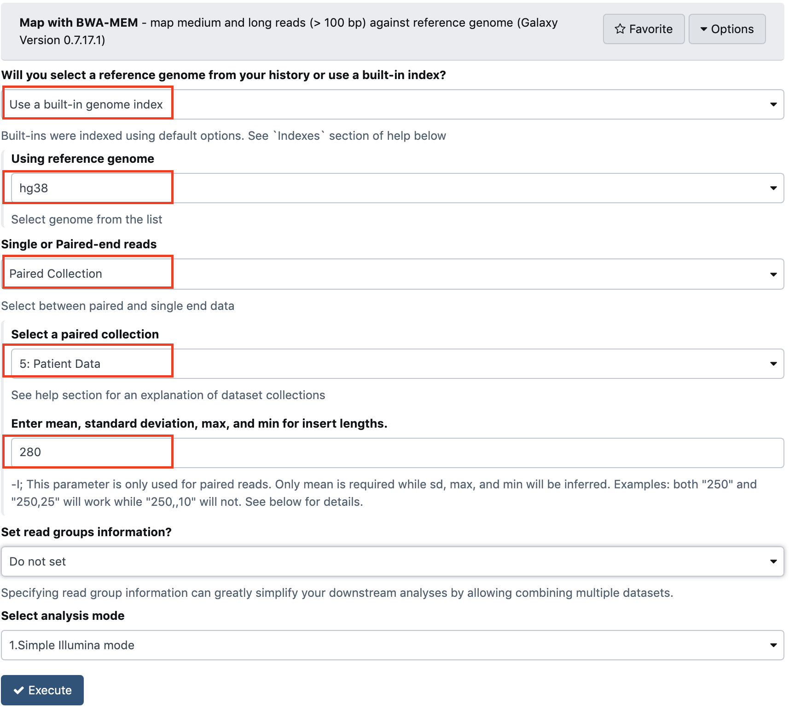

## BWA alignment of reads

1. Select the BWA-MEM tool in the Galaxy tool bar

2. Fill the `Map with BWA-MEM - map medium and long reads (> 100 bp) against reference genome (Galaxy Version 0.7.17.1)`
tool form carefully:

There are 5 parameters to check !

3. Click the `run` button