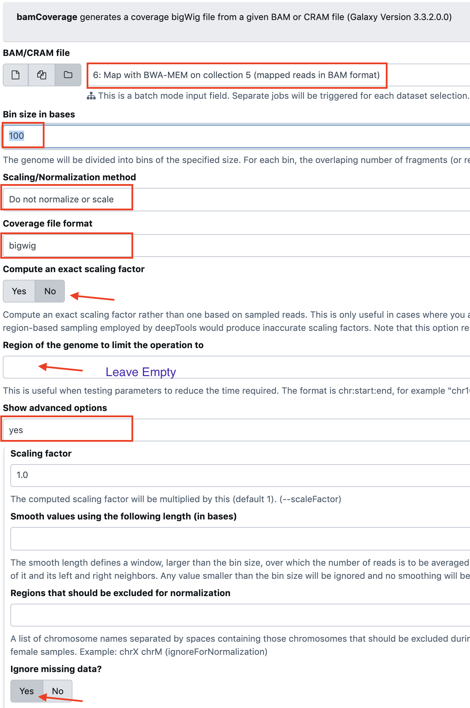

## Read Coverage using the Bamcoverage tool

Select the tool `bamCoverage generates a coverage bigWig file from a given BAM or CRAM file (Galaxy Version 3.1.2.0.0)`

- BAM/CRAM file: `Dataset Collection` and `Map with BWA-MEM on collection 3 (mapped reads in BAM format)`
- Bin size in bases: `100`
- Scaling/Normalization method: Do not normalize or scale
- Coverage file format: `bigWig`
- Compute an exact scaling factor: `no`
- Region of the genome to limit the operation to: `chr9`
- Show advanced options: `yes`
- Ignore missing data?: `yes`

Other options unchanged

- run the tool

- rerun the tool paying attention to
    - reselect BAM/CRAM file: `Dataset Collection` and `Map with BWA-MEM on collection 3 (mapped reads in BAM format)`
    - - Region of the genome to limit the operation to: `chr22`

