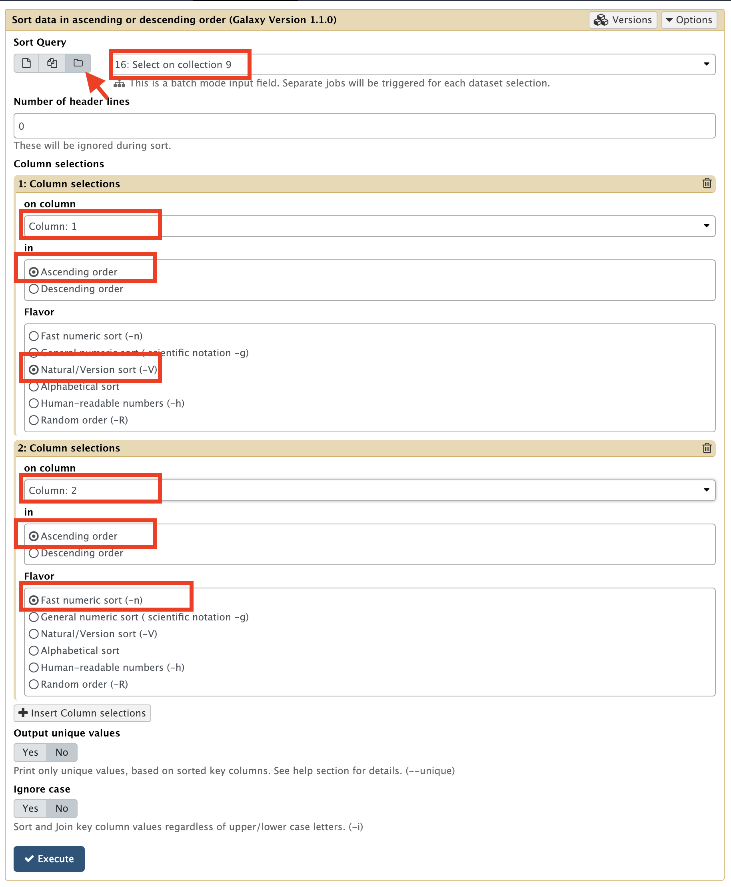
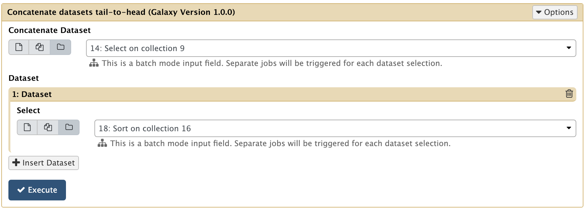
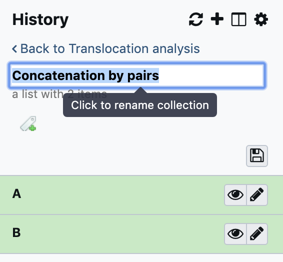
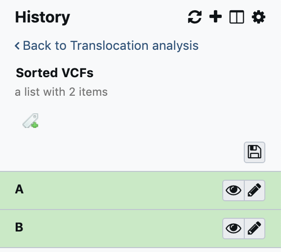

For visualisation in the UCSC genome browser, lines in the vcf file have to be sorted first
in the order of chromosomes and secondly in the order of coordinates.
        
In the following steps we are going to reorganising the lumpy vcf output to follow these rules.

In addition, since we are going to focus on translocations, we will filter out the other
variations we are not interested in.

---
### 1. Save the headers of the vcf files using the tool:

??? example "Select lines that match an expression (Galaxy Version 1.0.1)"
    - **Select lines from**: `9: Variant Lumpy Calling` (be careful to toggle the `Dataset collection` mode)
    - **that**: `matching`
    - **the pattern**: `^#`
    ```
    ^#
    ```
    

---
### 2. Save the rest of the vcf files in another Dataset Collection using the same tool:

??? example "Select lines that match an expression (Galaxy Version 1.0.1)"
    - **Select lines from**: `9: Variant Lumpy Calling` (be careful to toggle the `Dataset collection` mode)
    - **that**: `matching`
    - **the pattern**: `SVTYPE=BND`
    ```
    SVTYPE=BND
    ```
    

??? tip How to be faster
    Just re-play the previous tool run by clicking the circular arrow at the bottom of the dataset box,
    just changing the **pattern from** `^#` to `SVTYPE=BND`


This step allows to kill two birds with the same stone (tool):

- Selecting non-header part of the vcf
- filtering out the variations that are not of type `BND` (Bondaries)

---
### 3. Reorder the vcf lines describing the genetic variations using the tool:

??? example "Sort data in ascending or descending order (Galaxy Version 1.1.1)"
    - **Sort Query****: `16: Select on collection 9` (be careful to toggle the `Dataset collection` mode)
    - **Number of header lines**: `0`
    - **1: Column selections**
        - **on column**: `1`
        - **in**: `Ascending order`
        - **Flavor**: `Natural/Version sort (-V)`
    - **2: Column selections**
        - **on column**: `2`
        - **in**: `Ascending order`
        - **Flavor**: `Fast numeric sort (-n)`
    - **Output unique values**: `No`
    - **Ignore case**: `No`
    
    {: style="width:500px"}

---
### 4. Reassemble the saved headers with the sorted/filtered vcf parts using

??? example "Concatenate multiple datasets tail-to-head by specifying how (Galaxy Version 1.4.1)"
    Pay extra attention to the *name* and the *version* of the tool, because there is a number of concatenation tools with the same name
    
    - **What type of data do you wish to concatenate?**: `2 Collections`
    - **Depending on the type of input selected the concatenation options will differ**
        - **Input first collection**: `21: Select on collection 12`
        - **Input second collection**: `27: Sort on collection 24`
    - **Include dataset names?**: `No`
    - **Number of lines to skip at the beginning of each concatenation:** `0`
    
    {: style="width:500px"}

---
### 5. Rename the last generated collection from `Concatenation by pairs` -->

```
Sorted VCFs
```

{: style="width:250px"}-->{: style="width:250px"}

Do not forget to press the `Enter` Key !!!

