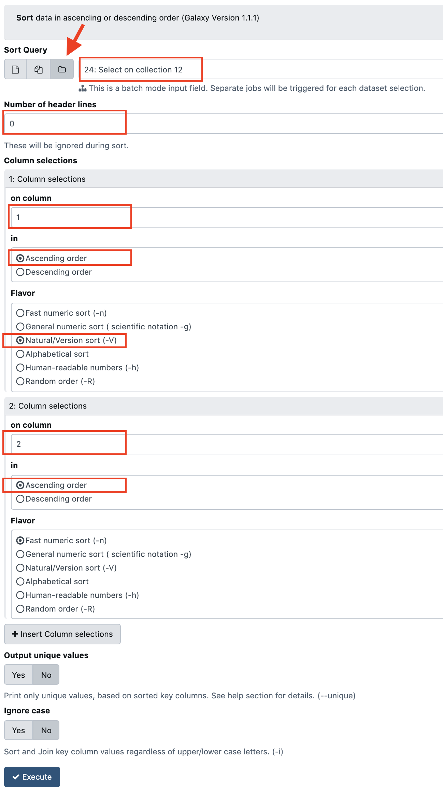
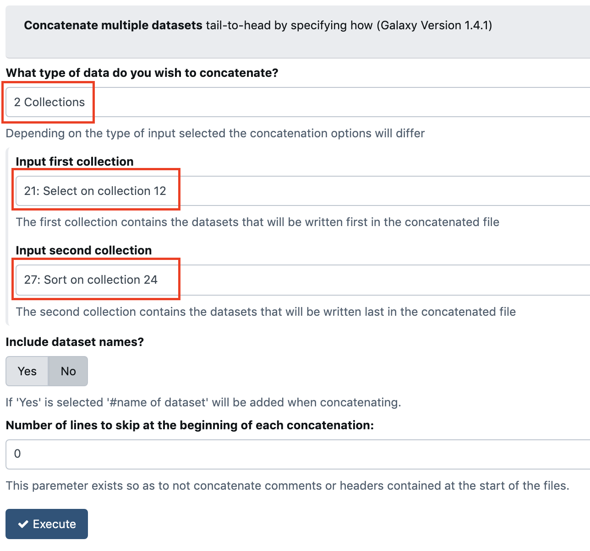

## Reformat the vcf output of lumpy-sv

### 1. Save the header of the vcf
This is just done using the tool `Select lines that match an expression (Galaxy Version 1.0.1)` with the parameter

- `Dataset collection`
- Select lines from: `9: Variant Lumpy Calling`
- that: `matching`
- the pattern: `^#`

### 2. Save the rest of the vcf file in another Dataset

Here we use the same `Select lines that match an expression` tools, this time with the parameters:

- Select lines from: `9: Variant Lumpy Calling`
- that: `matching`
- the pattern: `SVTYPE=BND`

##### TIP !
Just re-play the previous tool run, and just change the pattern from `^#` to `SVTYPE=BND`

This allows to kill two birds with the same stone:

- Selecting non-header part of the vcf
- filtering out the variations that are not of type `BND` (Bondaries)

### 3. Reorder the vcf lines in the previous dataset

To do that, we use the tool `Sort data in ascending or descending order (Galaxy Version 1.1.0)`

- Sort Query: `Dataset collection` and `16: Select on collection 9`
- Number of header lines: `0`
- 1: Column selections
    - on column: `Column: 1`
    - in: `Ascending order`
    - Flavor: `Natural / Version sort (-V)`
- 2: Column selections
    - on column: `Column: 2`
    - in: `Ascending order`
    - Flavor: `Fast numeric sort (-n)`

- Output unique values: No
- Ignore case: No

### 4. Reassemble the saved header with the sorted/filtered vcf lines

To do that, we use the tool `Concatenate datasets tail-to-head (Galaxy Version 1.0.0)`
Pay extra attention to the version of the tool, because there is a number of concatenate tools with the same name.

- Concatenate Dataset: `Dataset collection` and `14: Select on collection 9`
- Click on `+ Insert Dataset` to trigger an additional form section
- Dataset: `Dataset collection` and `18: Sort on collection 16`
- 1: Column selections

### 5. Rename the dataset within the last dataset collection.

Here we will rename the dataset of the last dataset collection. Here, there is something that maybe
tricky to understand.

A dataset collection is a kind of dictionary whose elements, the datasets, have as labels the key of this dictionary.
However, the real name of this dataset is hidden.

To see the real name of the dataset, navigate in the last collection (click on it) and further click the pencil icone.

Here you can change the real name of the dataset, which is useful for the next step of visualisation in Genome Browser

Rename it as `patient A vcf` or `patient B vcf` and click `Save`
