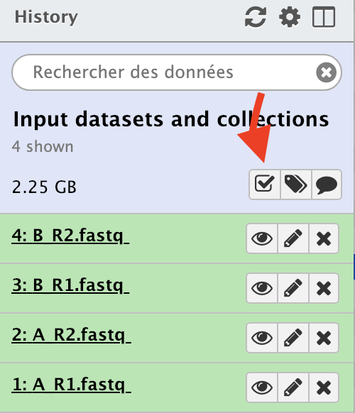
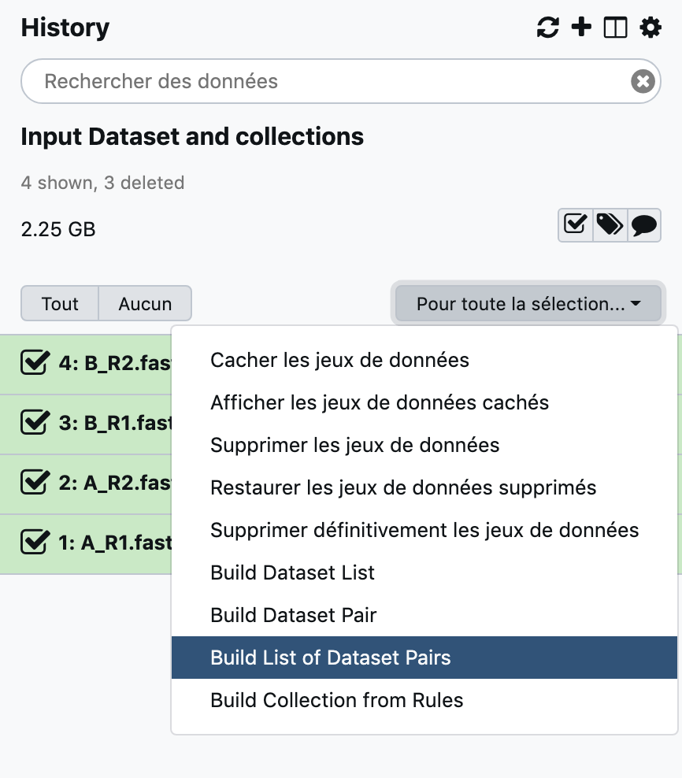
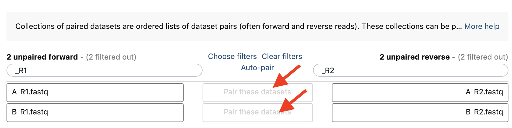
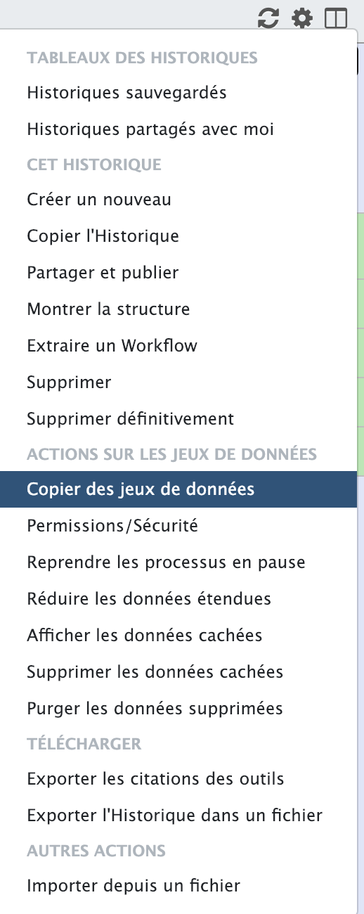

## Prepare your input data history

1. Rename your `Unnamed history` to `Input Dataset and collections`
2. Go to menu `Shared Data`--> `Data Libraries` (`Données Partagées` --> `Bibliothèque de Données`)
   

3. Choose `Mouse Genetics` library
4. Select the 4 fastq files (A_R1.fastq, A_R2.fastq, B_R1.fastq and B_R2.fastq)
5. Select the `To History` tab --> `as datasets`
   

6. Select your freshly renamed `Input Dataset and collections` in the `select history` menu
7. Click `Import` button
8. After the import, navigate directly to this history by clicking the `green warning`
9. Prepare two `collections` from your raw input datasets.
    - Toggle the "checkbox" mode by clicking the small checkbox icon at the top of the history bar
    
    - Select the 2 A fastq files OR the 2 B fasq files (not all 4 files, choose as you feel it!)
    - Select `Build List of Dataset Pairs` from the tab `Pour toute la sélection`
    
    - in the pop up window, replace `_1` by `_R1` and `_2` by `_R2`
    - Click the `Pair these datasets` tab
    
    - Name your new "paired dataset" collection with a single element `A_fastq` (or `B_fastq`if you chose the B fastq file at the previous step) and click on `Create list`
    - Back to your history, that is still in "checkbox" mode, select the 4 fastq files, and repeat the operation to produce this time a collection of 2 paired-sequences element, which you will name this time `patient sequences`
10. Time to start the analysis:
    Select the `Copy datasets`in the history "wheel" menu 
    
    - Select the first collection with a single element (A or B) that you first prepared
    - in the `destination history` area, fill the `New history named` field with `Single sequence dataset analysis` and click the `Copy History Items` button
    - Click the link that shows up to navigate directely to this new history !
