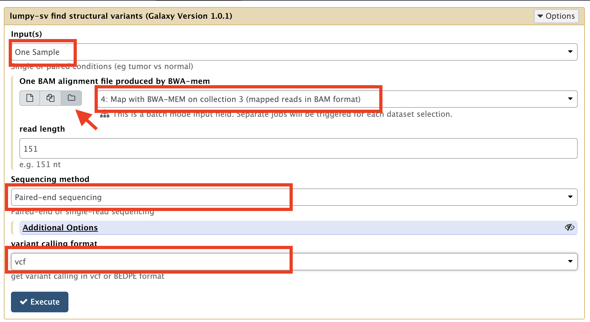

## Lumpy tool - lumpy step

Now you are going to analyse the BAM alignment file generated by BWA, using lumpy-sv.

The lumpy-sv tool analyse the alignments and search for

- split alignment

    a read whose 5' and 3' parts map to non-contiguous regions

- discordant alignments of read pairs

    Either one mate maps to one chromosome and the other mate maps to another chromosome, or
the distance between the two mates is beyond what is statistically expected (the library fragment
size in average).  For an insertion, the distance increases, for a deletion, the distance decreases

from, this parsing, lumpy then constructs models of break points that can explain its findings, and report these models
in a vcf file (vcf stands for variant calling format), with statistical significance, number of evidences founds, etc...

    1. launch the lumpy-sv tool

    2. review the parameters:
        - input(s) : One sample (because we are not comparing the alignments with a reference alignment)
        - One BAM alignment file produced by BWA-mem: be sure to toggle the dataset collection mode
        (arrow in the screen shot below).
        - sequencing method: paired-end sequencing
        - variant calling format: vcf

    3. run the tool !

    4. Look at the vcf returned by lumpy-sv.
It should be easy to read: lumpy output variation as a suite of single lines (for deletions, insertion, or SNPs), or
as a suite of line pairs, for translocation (one line for the translocation, another line for the reciprocal translocation).
Note that sometimes, there is evidence for one translocation, but not for the reciprocal event. Look at the ID column: a
pair of translocation event model will have for instance IDs and 2_1 and 2_2, respectively.

However, the lumpy vcf format is not suitable for visualisation in a genome browser such as UCSC genome browser.
For these browser, lines have to be sorted in the order of chromosomes (first) and in the order of coordinates (secondly).

The next steps of the analysis are for reorganise the lumpy vcf output to follow these rules. Also, we are going to focus
on translocations, filtering out other variation we are not interested in.