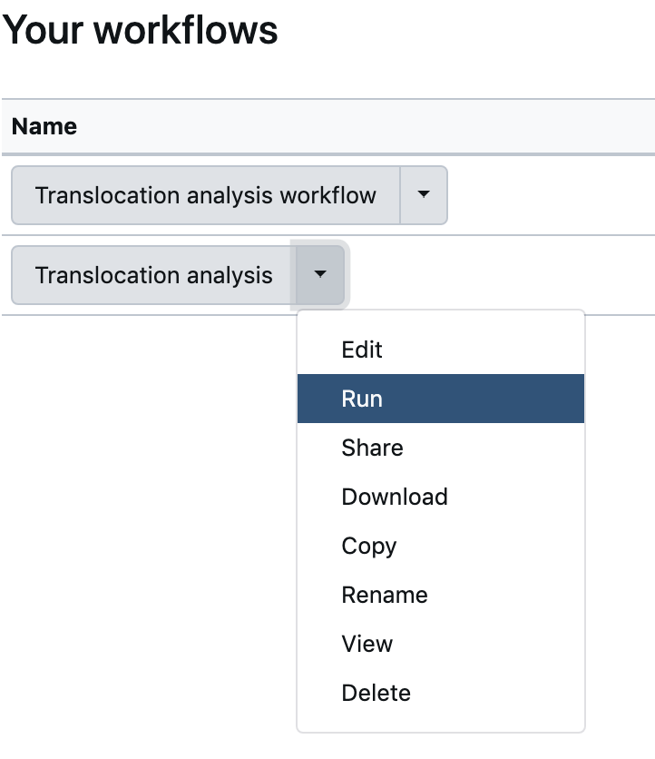
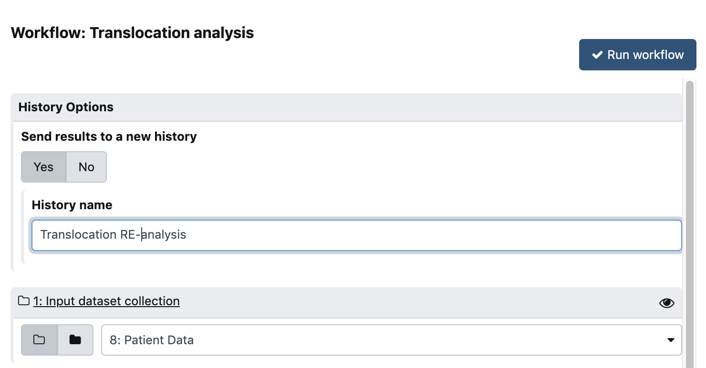

## 1. Go to the history that contains your input data and collection

- Menu `User` --> `Saved histories`
- Select your `Input Datasets and collections` history

## 2. Select the menu Worflow and run the workflow that you have built

{: style="width:250px" align="top"}

## 3.  Launch the workflow

- Select `Yes` for **Send results to a new history**
- Edit the **History name** to something that makes sense to you (`Translocation Re-Analysis`, for instance)
- Select the `Patient Data` Collection (but it should already be selected as this is the only collection in the history)

