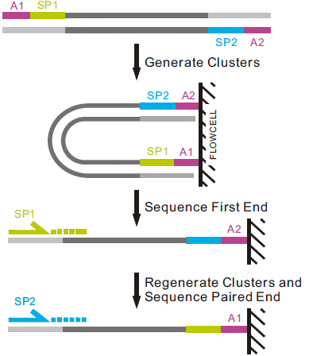

## DNA libraries and sequencing protocol for patient samples

- Bone marrow samples from patients with Acute Lymphoid Leukemia (ALL)
- Genomic DNA from bone marrow cells
- DNA fragmentation (expected ~200-500nt long)
- Selection of DNA fragments :
    2 regions of several dozens of kb centered on BCR and ABL1
- Library preparation
- Sequencing of both ends of fragments: Paired-End sequencing (see figure below)

