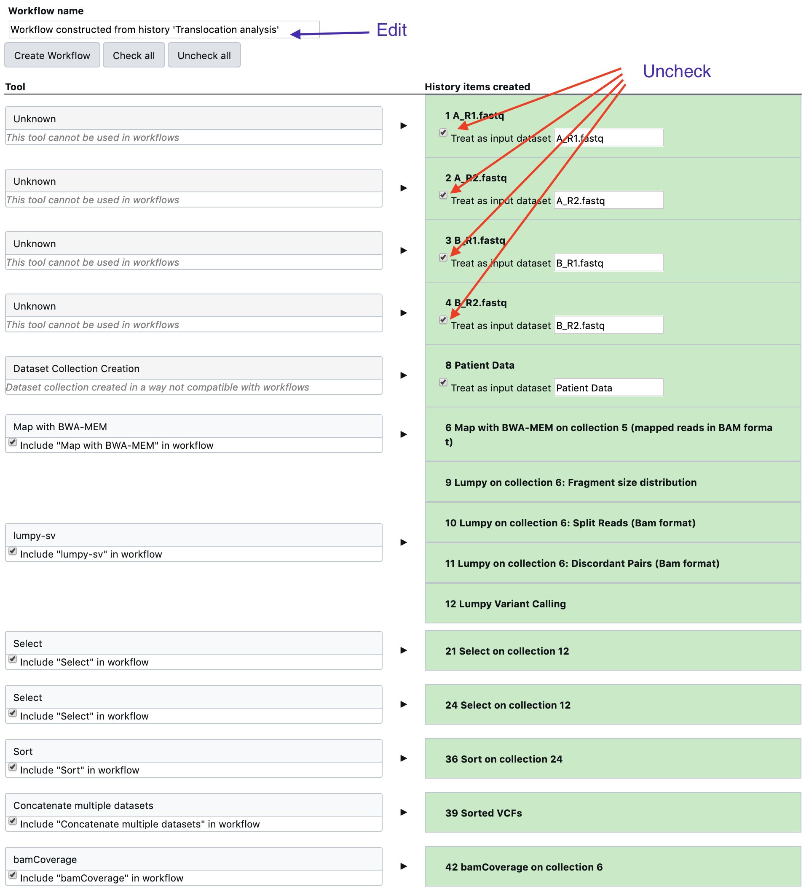
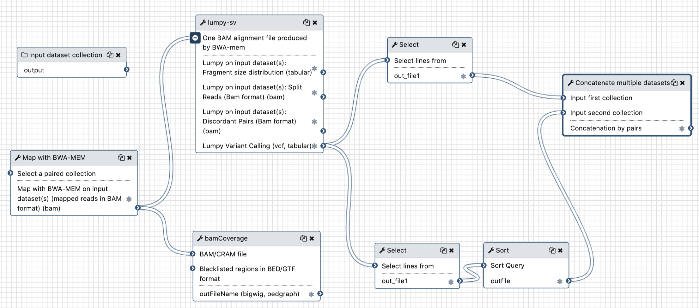
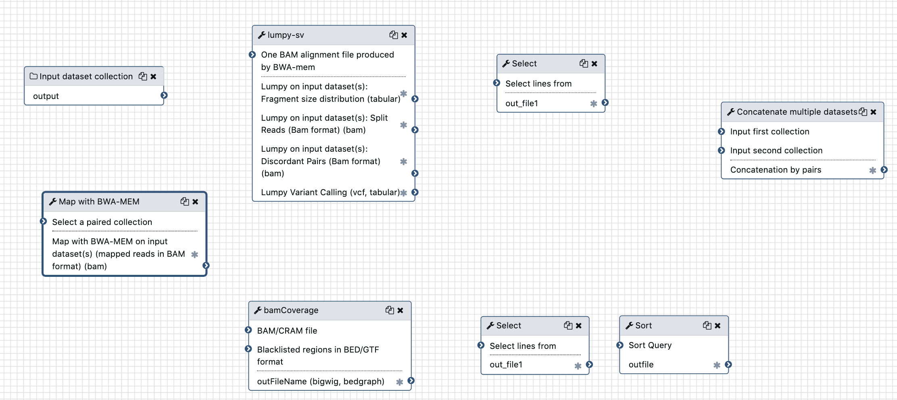
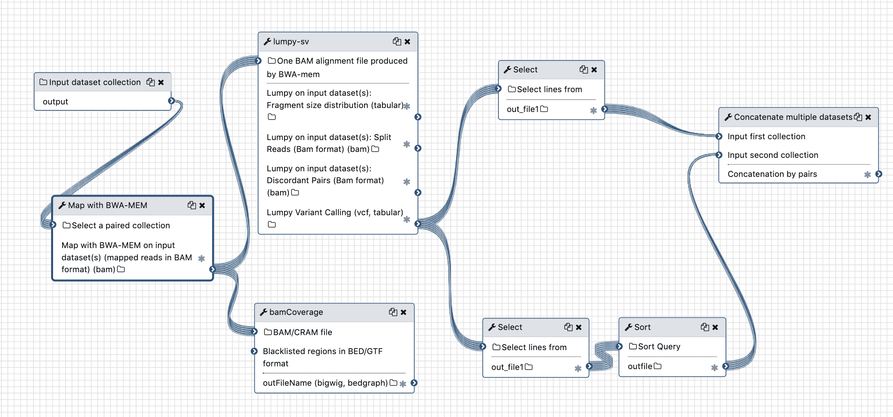
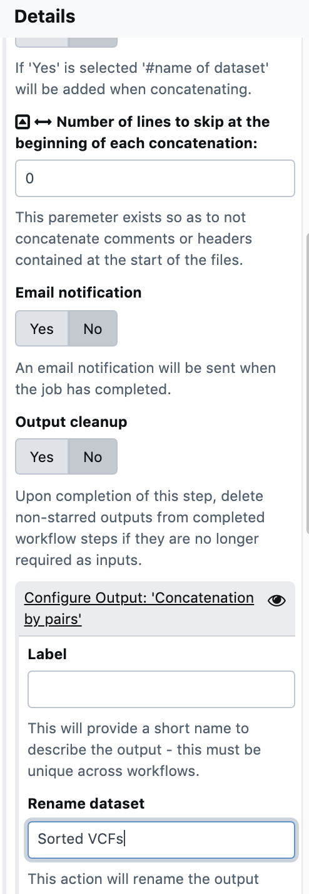

## 1. select the "extract workflow" item in the history menu

{: style="width:250px"}


## 2. Uncheck and rename before workflow extraction

{: style="width:700px"}


## 3. Edit workflow

### step 1: distribute evenly and unlink tools






### step 2: reconnect tools, **starting from the input data collection**



!!! bug "Warning"
    When reconnection, you may have the warning
    ```
    Can't map over this input with
    output collection type - an output
    of this tool is not mapped over
    constraining this input.
    Disconnect output(s) and retry.
    ```
    This is a bug and
    You may need to manipulate a little the workflow editor before being able to reconnect the
    `input data collection` box to the `Map with BWA-MEM` tool box.
    Try to save the unlinked workflow, quit and reedit, or manipulate the **Collection type**
    parameter of the `input data collection` box, by clearing the field and re-entering
    `list:paired`. After a while it will go...
    ```

### step 3: edit the last step of the workflow to rename the output

{: style="width:300px" align="top"}
