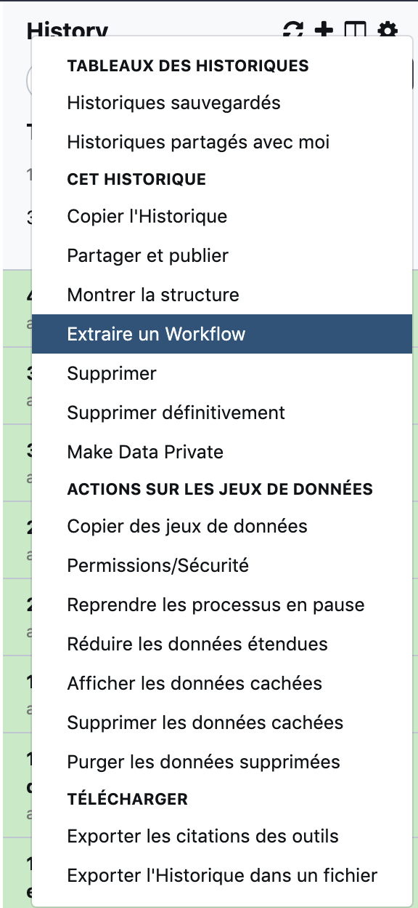

## 1. select the "extract workflow" item in the history menu

{: style="width:250px"}

## 2. Uncheck and rename before workflow extraction

{: style="width:700px"}

## 3. Edit workflow

### step 1: distribute evenly and unlink tools

### step 2: reconnect tools, **starting from the input data collection**

### step 3: edit the last step of the workflow to rename the output

{: style="width:300px" align="top"}